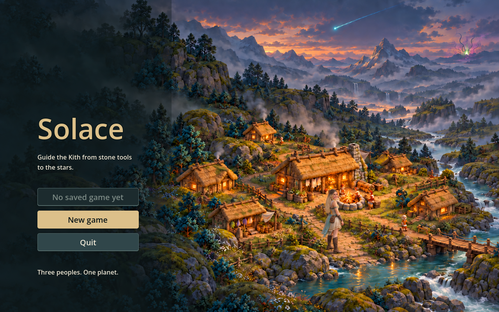
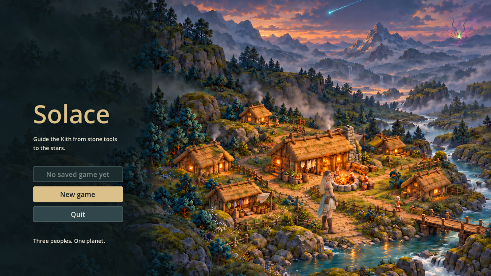

# Briana: lead Lumen stranger (PR #75)

Jon chose Briana as the first of the three Lumen strangers to leave the fog and the first to trust the Kith. These two pieces continue the approved Misty Highlands direction. Private references were used locally and are not included in Git.

## Delivered art
- `art/sprites/lumen_briana.png`: original 1078×1459 transparent painted miniature. Blonde hair, open smile, ivory/pale gold clothing, cyan drape and small jewelry accents. One idle pose: the current stranger caller supports sway, not a dedicated frame sequence.
- `art/rendered/title_briana.png`: original 1584×993 opaque companion to the approved title in PR #68. Warm dusk settlement, falling cyan star and distant Bloom hint; Briana stands right of center, half turned back. The left third stays quiet for menus. The generator returned less than the requested approximately 2560×1600; this is the original output, without artificial enlargement.
- Both PNGs have Godot-generated `.import` files. Existing assets, gameplay footprints and the default title are unchanged.

## Claude hookup
Briana belongs to stranger index **0**, not a new fourth visitor. In `KithArt.draw_strangers`, keep arrival checks, survivor spots, sway and aura; replace only that index's borrowed Kith appearance. Load the texture, wrap its region **[277,92,524,1333]** in an `AtlasTexture` (`filter_clip = true`), cache it and use `Rendered.fit(ci, texture, Rect2(at + Vector2(-12,-24), Vector2(24,24)))`. The crop is measured at alpha > 0.05 with four source pixels of padding. Do not fit the raw transparent canvas: its margins reduce readability. Keep the two other strangers from PR #71.

The alternate title is not selected in production. Claude should add an explicit alternate-art selection/loading hook for `res://art/rendered/title_briana.png`, retaining the default painting, menu and save behavior. `capture.gd` injects this texture into the existing title instance only for documentation previews; it does not change production code or run saves.

## Review and limits

Godot imports and both capture scripts passed. Native 24 px and 96 px sprite inspection shows the blonde/gold/cyan silhouette; fine facial likeness and jewelry cannot be resolved at 24 px. The title deliberately preserves more face detail, but still uses an enlarged heroine scale relative to the tiny background Kith after two scale/pose corrections. Review that composition as an illustration, not a gameplay-scale promise. No idle frame animation was added; existing sway can be retained at hookup. A real Starfall play pass is still needed after Claude selects the sprite.

Built-in `image_gen` generated the art. [Prompt set and provenance](prompts.json); [measured regions](regions.json). The production PNGs are byte-identical to their selected tool outputs. Preview images are native Godot renders, not AI paintovers. Full CI is tracked on PR #75.
