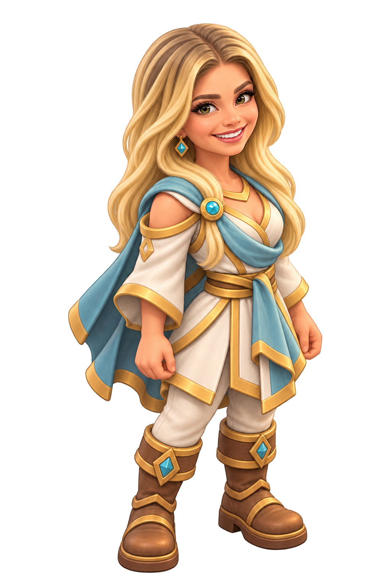

# Briana: character review first (PR #75)

Jon liked the original standalone character as a reference and rejected all three title character attempts for incorrect scale. On 2026-10-06 he directed a staged workflow: first refine the character with a less overhead camera, then use that character in the foreground over the exact original approved title background. Do not integrate the rejected alternate title.

## Current character stage

`character-v2.png` is an isolated full-body painted adult Lumen design with a lower camera, compact game-inspired proportions, long blonde hair, an open smile and pale gold/cyan clothing. It is a design review asset, not a replacement for the top-down gameplay slot. The original 1024×1536 tool output is preserved. Sampled empty surrounding pixels have alpha 0; brown RGB in those transparent pixels is not an opaque backdrop.

The original character is saved at [reference/briana-v1.png](reference/briana-v1.png). The intermediate overhead miniature experiment is [reference/briana-v2-overhead.png](reference/briana-v2-overhead.png). Private likeness photos are not included in Git.

## Next stage, after character review
Jon also requested [his own separate Kith character](../jon-kith/README.md). The next composition pairs these two characters in the foreground.

Use the exact approved landscape from PR #68 (`art/rendered/title.png`) as the background. Add the accepted character as a separately controlled foreground layer, with the town clearly behind her. Keep the menu's left third clear. Do not regenerate the town or put a large figure on the village's middle-distance ground plane. No new title composition is delivered at this stage.

## Withdrawn title attempts
The active alternate title PNG/import and active menu captures were removed from this PR. The last rejected image and captures live only under `archive/title-v1/` as historical context; the two earlier generated attempts were never production assets. The old capture script in that folder is historical and points to the withdrawn slot; do not use it as current validation. The approved original title remains unchanged.

## Gameplay sprite status
`art/sprites/lumen_briana.png` remains the original one-pose asset with its generated import, pending review and hookup. Its region is [277,92,524,1333], fitted bottom-center in 24×24 pixels. Do not switch the map slot to the lower-angle title character automatically. The existing caller supports sway, not dedicated idle frames. Claude should hold both Briana integration and alternate-title selection until the staged review is complete.

## Provenance and checks
Built-in `image_gen` produced all character art; [original prompts](prompts.json) and [current character prompt](character-v2-prompt.json) record generation. Originals are copied unchanged. Original gameplay sprite import/native 24/96 px preview passed. Lower-angle review output exists and has transparent surrounding pixels. No game code, save, visitor count or progression changes. Prior title menu checks apply only to the rejected version and are not acceptance evidence for the next composition. CI is tracked on PR #75.
