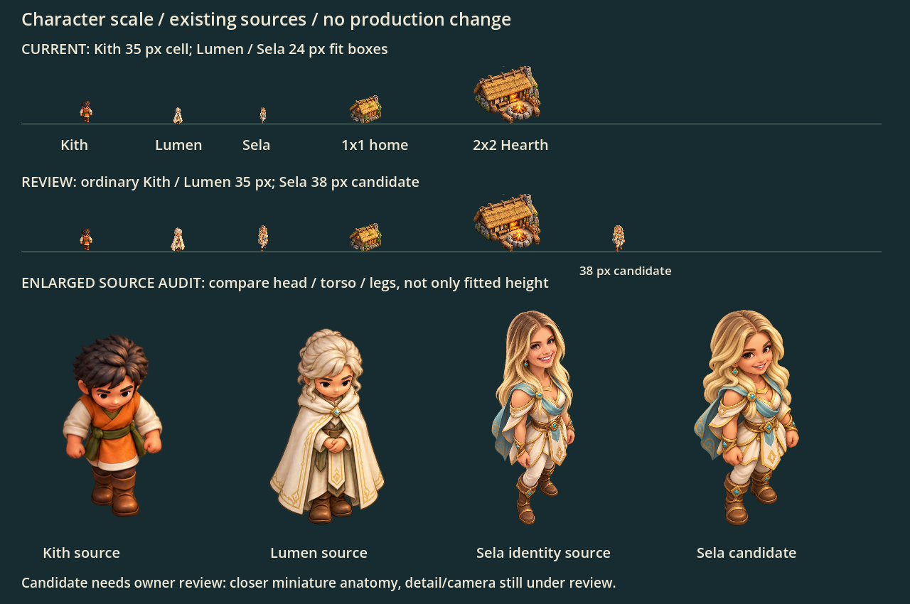

# Approved character reference and source audit

Shared spec: [character standard](../../design-system/mockups/character-standard.md).

Godot renders the existing assets unchanged. Current Kith use the production function; Lumen/Sela show current 24 px and proposed 35/38 px fit targets. The lower row enlarges the same source textures to expose anatomy differences. The owner approved the 35 px common target, about 38 px Sela and the separate Sela proportion reference on 2026-10-09, as relayed in mailbox comment 6084666694. Historical review labels in the capture are retained.

Run Godot with `--path . --script docs/art/character-standard/preview.gd`. No production code, art originals, private photos or import metadata are changed.

One [Sela candidate](sela-candidate.png) tests shorter miniature anatomy against the existing sources, also at 38 px. It is now the approved Sela proportion reference; its historical filename is retained. Its built-in ImageGen prompt, source basename and measured alpha bounds are retained in the adjacent JSON files. Future Sela drawings follow this reference; no game sprite is replaced by this documentation PR.
