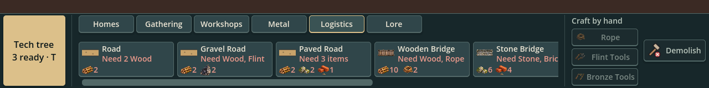
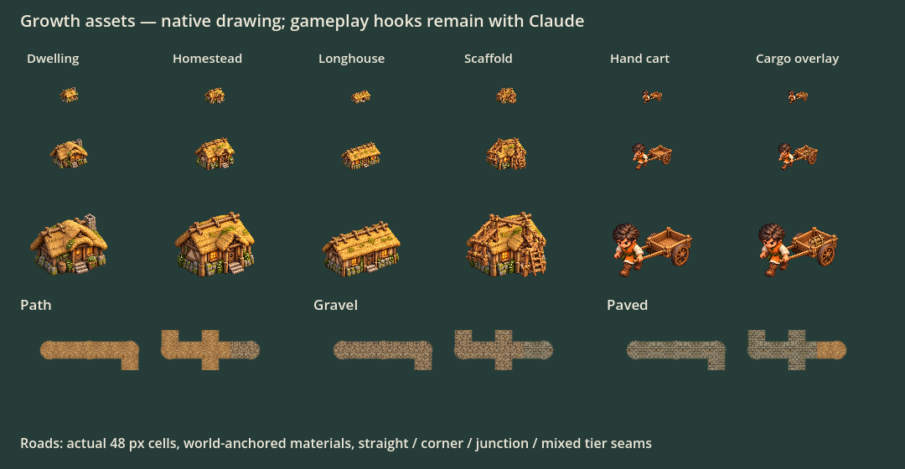

# Growth visuals and build-bar fit

Jon assigned these assets and the clipping fix on 2026-10-05. Claude owns logistics/needs rules and selects state in PR #50 and the following needs PR. Beast carts and canon changes are outside this delivery.

## Production UI fix

The build bar keeps Tech, Craft by hand and Demolish on screen. The center expands into available space, with horizontally scrollable tabs and fixed-width cards. Scrollbar height is reserved so tab changes do not change bar height. No price, visibility, recipe, placement or simulation rules changed; Claude's #50 edits to those rules can merge separately.



Native layout regression checks widths 800/1100/1280/1600 across all tabs, full-card scroll access, pinned action bounds and recipe signals. Keyboard tab navigation of build cards is unchanged; the card row was already mouse operated.

## Imported asset kit



Four original generated PNGs under `art/rendered/` have Godot import metadata. `scripts/growth_art.gd` supplies cached named slots and visual drawing only. The new tiers/cart/scaffold are **ready for Claude's gameplay hooks, not selected by main yet**. The build-bar layout is active immediately.

| Slot | Source | Meaning |
|---|---|---|
| `dwelling` | Existing rendered house | Tier 1 reused |
| `homestead` | `growth-houses.png` | Tier 2: compact substantial cottage/entry |
| `longhouse` | `growth-houses.png` | Tier 3: longer roof, two windows |
| `upgrade_scaffold` | `growth-scaffold.png` | Open rope-lashed construction frame |
| `hand_cart` | `growth-hand-cart.png` | Exactly one Kith, empty two-wheel cart |
| `path`, `gravel`, `paved` | `growth-roads.png` | Full surface materials, not square map stamps |

Exact region bounds live in `GrowthArt.REGIONS`; PNGs are unchanged originals. The house sheet's actual subject separation differs from its prompted equal cells, so bounds were measured and verified in the native preview. Subjects have real transparent backgrounds; the scaffold's center is transparent. The longhouse remains 1×1 logically and is distinguished by roof length, not extra placement cells. All figures share the miniature lighting and palette. Static cart pose is intentional here; directional animation is a separate request.

## Claude hook contract

```gdscript
const GrowthArt = preload("res://scripts/growth_art.gd")

# tier 1/2/3; box is the original 1x1 cell; caller derives the tier from its rules.
GrowthArt.draw_house(canvas, tier, box)
var icon = GrowthArt.house(tier)

# Draw after the building only while actual construction is active.
GrowthArt.draw_scaffold(canvas, box)

# One composite worker + cart. Cargo is an optional existing item texture.
GrowthArt.draw_hand_cart(canvas, box, Rendered.named("item_wood"))

# Road tiers 0/1/2. Existing topology/fog rules remain authoritative.
var surface = GrowthArt.road_material(road_tier)
var material = GrowthArt.road_shader_material(road_tier, Vector4(left, right, up, down), tile_origin, 48.0)
```

The connected-road shader applies to a persistent visual node drawing `GrowthArt.ROADS` into a tile-sized rectangle with 0..1 UV. Reuse nodes/materials; update uniforms when state changes rather than allocating each frame. `tile_origin` uses unscaled 48 px world coordinates; the presentation layer applies camera transforms. Supply only revealed road/passage connections, and preserve existing bank/bridge caps, selection and fog masking. Continuous world sampling and mirrored material UV keep adjacent cells aligned; rounded dead ends and softly masked shoulders avoid opaque square bases. A tier change intentionally changes material at the cell boundary.

The native preview exercises straight, corner, junction and mixed-tier boundaries; it is a controlled asset exercise, not a saved-game screenshot. Production batching/caching and integration with the existing terrain mask remain Claude's hook work; this kit does not promise finished landscape beauty or alter the review-only terrain study.

## Verification

- Godot import generated four `.png.import` files and new script/shader UIDs.
- Focused native build-bar fit and slot/alpha/bounds/RNG/road-seam checks pass.
- Native preview inspected at 24/48/96 px. At 24 px silhouettes remain distinct; item details rely on labels.
- GDScript lint/format and diff checks pass. CI run 37405354942 on 9a0f2b9 passed import/metadata/warnings/main load/all logic tests, but its play-through bot stalled before Bronze Dawn (6001 frames, three Kith); the same failure reproduced locally without failed UI-click or asset assertions. Long layout CI did not run. Claude has the failure/reproduction on PRs #50/#51; full green CI remains required before merge.

From repository root, with your Godot binary:

```sh
tests/tools/run_checked.sh GODOT --path . --script tests/tools/build_bar_fit.gd
tests/tools/run_checked.sh GODOT --path . --script docs/art/growth-visuals/preview.gd
tests/tools/run_checked.sh GODOT --headless --path . --script tests/tools/growth_art_check.gd
```

Exact image-generation prompts and source paths: [`art/rendered/growth-prompts.json`](../../../art/rendered/growth-prompts.json). Source files are unmodified; alpha bounds measured in Godot by `measure.gd`.
