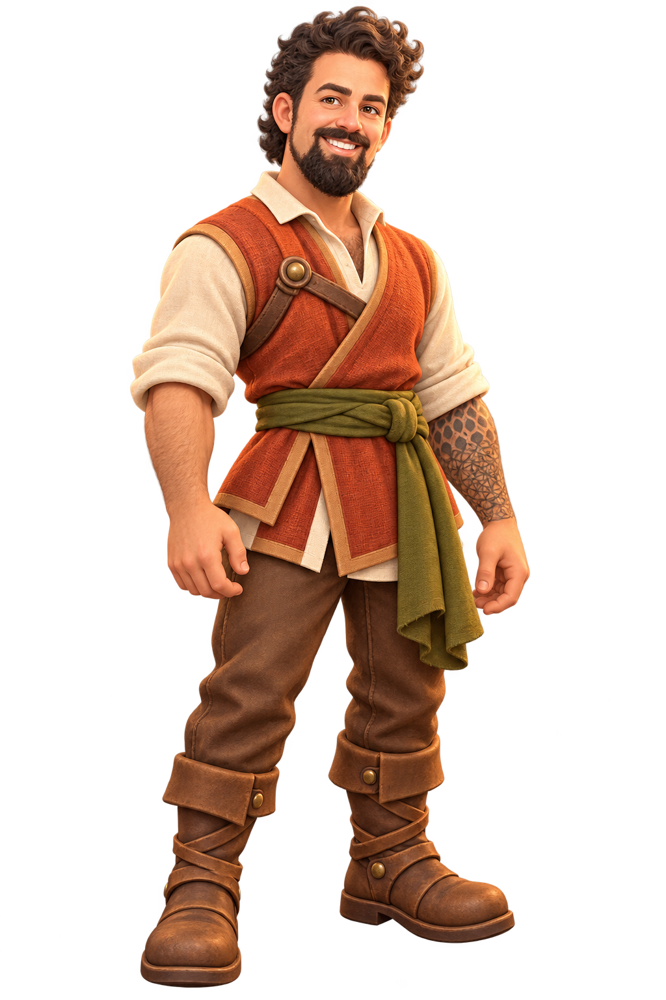

# Kith character — standalone study

This separate painted character study supports the foreground title pair; it does not introduce a gameplay character.

Dark curls, a beard, a friendly smile and a geometric arm marking distinguish the design. Rust clothing, cream sleeves, a moss sash and leather boots keep the warm Kith palette. The lower three-quarter camera matches the [lead stranger study](../lead-stranger/character-v2.png).

The original generated 1024×1536 image retains its transparent background. The [title pair](../title-pair/README.md) places both characters over the unchanged original landscape. PR #75 remains held for visual review.
