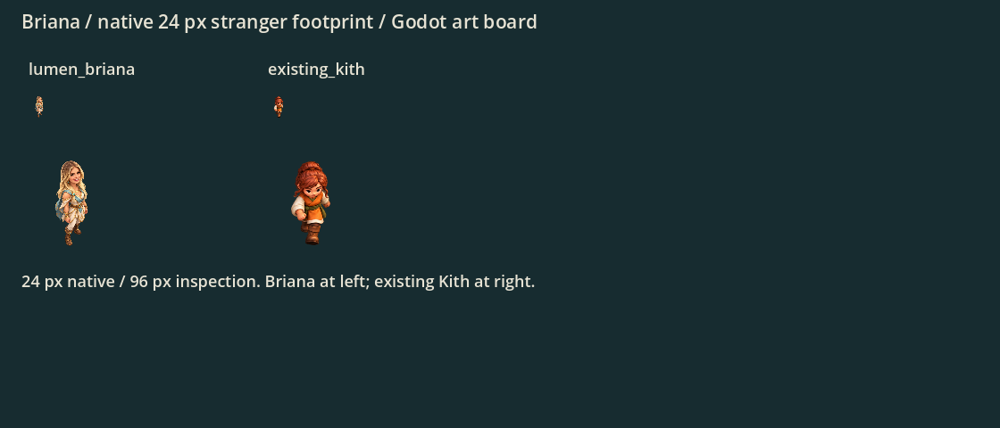

# Sela: character review first (PR #75)

the project owner liked the original standalone character as a reference and rejected all three title character attempts for incorrect scale. On 2026-10-06 he directed a staged workflow: first refine the character with a less overhead camera, then use that character in the foreground over the exact original approved title background. Do not integrate the rejected alternate title.

## Current character stage

`character-v2.png` is an isolated full-body painted adult Lumen design with a lower camera, compact game-inspired proportions, long blonde hair, an open smile and pale gold/cyan clothing. It is a design review asset, not a replacement for the top-down gameplay slot. The original 1024×1536 tool output is preserved. Sampled empty surrounding pixels have alpha 0; brown RGB in those transparent pixels is not an opaque backdrop.

The original character is saved at [reference/lead-stranger-v1.png](reference/lead-stranger-v1.png). The intermediate overhead miniature experiment is [reference/lead-stranger-v2-overhead.png](reference/lead-stranger-v2-overhead.png).

## Completed foreground stage
the project owner also requested [a separate Kith character](../kith-study/README.md). He then authorized pairing both. The [current foreground title composition](../title-pair/README.md) now contains both characters.

The final title uses the exact approved landscape from PR #68 as its background, plus a separate generated foreground pair. Original painting and source layer remain unchanged; the town sits behind the cropped near characters and the left third stays clear.

## Withdrawn title attempts
The old alternate title PNG/import and menu captures were withdrawn; the production filename now contains the new pair composition. The last rejected image and captures live only under `archive/title-v1/` as historical context; the two earlier generated attempts were never production assets. The old capture script in that folder is historical and points to the withdrawn slot; do not use it as current validation. The approved original title remains unchanged.

## Gameplay sprite status
`art/sprites/lumen_lead.png` remains the original one-pose asset with its generated import, pending review and hookup. Its region is [277,92,524,1333], fitted bottom-center in 24×24 pixels. Do not switch the map slot to the lower-angle title character automatically. The existing caller supports sway, not dedicated idle frames. Claude should review the current pair composition before selecting the alternate title and review the map sprite separately.

## Provenance and checks
Built-in `image_gen` produced all character art; [original prompts](prompts.json) and [current character prompt](character-v2-prompt.json) record generation. Originals are copied unchanged. Original gameplay sprite import/native 24/96 px preview passed. Lower-angle review output exists and has transparent surrounding pixels. No game code, save, visitor count or progression changes. Current title-menu checks are in the pair composition document; archived checks apply only to the rejected version. CI is tracked on PR #75.
