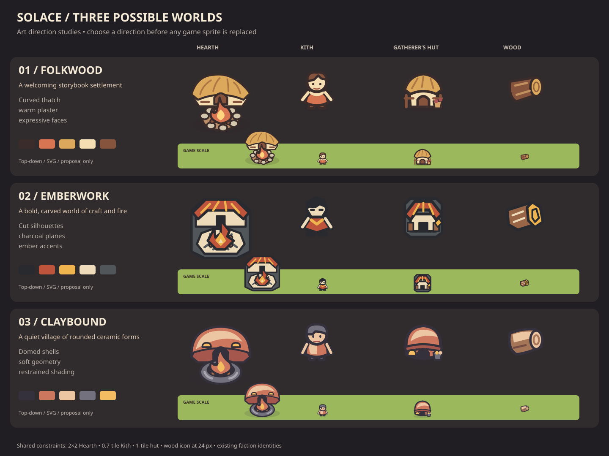

# Solace: three visual directions

## Current follow-up: Misty Highlands

Jon's subsequent direction is grounded, atmospheric, beautiful and mysterious, with rendered miniature materials and sturdy stylized Kith. See the [rendered tile kit and dense-map scale tests](misty-highlands/README.md). The original three SVG studies below are retained for comparison; they are not the selected production direction. Raster studies are documentation-only and do not change the SVG production contract.

Status: **proposals for Jon to choose**, 2026-10-03. No game sprites are replaced and no direction is approved by this PR. The current art direction remains the production baseline until Jon chooses.

The same four subjects appear in every direction: the Hearth, a Kith, the Gatherer's Hut, and **Wood**. Using one resource throughout makes the silhouette and material choices directly comparable. Each sample is a standalone plain SVG with a transparent background. The Hearth uses a 64×64 viewBox; the other samples use 32×32.

## 01 — Folkwood

A welcoming storybook settlement, built from curved thatch, warm plaster and timber. Sweeping roofs and expressive faces make home feel handmade. Open building silhouettes replace the square plate in these studies, giving the world a softer, more organic rhythm.

- **Map language:** rounded tree canopies, irregular rock clusters and quiet grass; roads become broad earth ribbons. These are future applications, not delivered terrain assets.
- **UI extension:** cocoa panels, cream text and rounded frames; keep Kith orange for primary actions and gold for goals.
- **Later eras:** add metal fittings to the same timber forms; cool the surroundings after the landing while retaining warmth around inhabited places.
- **Tradeoff:** the most welcoming option, but foliage and buildings will need distinct silhouettes to avoid blending together. Wood's growth ring is decorative; the cut end carries recognition at small sizes.

| Hearth | Kith | Gatherer's Hut | Wood |
|---|---|---|---|
|  |  |  |  |

Palette: outline `#392c2b`, clay `#d77553`, straw `#dca85b`, plaster `#f5dfb2`, timber `#86533c`.

## 02 — Emberwork

A bold world of craft and fire, with carved silhouettes, charcoal masses and warm ember accents. Angular roofs, a faceted fire ring and a sharply cut Kith silhouette create a graphic identity. Beveled building plates preserve the board-game clarity of the current look.

- **Map language:** broad polygonal tree masses, cut stone planes and low-detail terrain; reserve dark contours for interactive subjects.
- **UI extension:** squared cocoa cards with clipped corners, strong cream labels and small gold marks. Avoid decorative hatching behind numbers.
- **Later eras:** the existing bevels naturally extend into metalwork; ember accents can become furnace light. Darker terrain supports the ominous shift without losing unit contrast.
- **Tradeoff:** strongest graphic contrast and easiest dense-map separation, but the darkest masses can feel severe. Keep warm materials and broad face areas prominent.

| Hearth | Kith | Gatherer's Hut | Wood |
|---|---|---|---|
|  |  |  |  |

Palette: outline `#282a30`, ember `#bd543b`, ochre `#efb44e`, bone `#eddbba`, iron `#51565b`.

## 03 — Claybound

A quiet village of rounded ceramic forms, low domed shelters and soft geometry. Two flat color planes suggest volume without painted textures or gradients. The Hearth's smooth stone basin and the Kith's rounded cap give this direction a cohesive sculpted feel.

- **Map language:** smooth canopy lobes, rounded boulders and broad river curves; keep terrain contrast low so the shells read clearly.
- **UI extension:** rounded cocoa panels and cream labels, with restrained clay accents. Status colors retain their current semantic roles.
- **Later eras:** attach bronze bands and pipework to rounded shells; use cooler iron accents as technology progresses. Lumen and Bloom retain their established faction colors.
- **Tradeoff:** calmest and most materially distinctive option, but repeated domes could make workshops look alike. Future buildings would need unique attachments and roof cuts. These shelters are visual studies, not a change to construction recipes or lore.

| Hearth | Kith | Gatherer's Hut | Wood |
|---|---|---|---|
|  |  |  |  |

Palette: outline `#34313c`, clay `#cd775e`, light `#ecc6a3`, cool stone `#74717e`, fire `#f4bd62`.

## How to choose

Choose **Folkwood** for warmth and charm, **Emberwork** for graphic clarity and a stronger craft identity, or **Claybound** for a calm sculpted world. The comparison board includes enlarged studies and a shared grass strip at the documented display sizes: Hearth 96 px, Kith 34 px, Hut 48 px, Wood 24 px. These are visual size studies, not screenshots of the running game.

All three retain the top-down map convention and existing subject identities. Proposed outline colors and building shapes are intentionally exploratory; this PR does not change `05-art-direction.md`, gameplay, faction canon, UI tokens, sprite slots, filenames in `art/sprites/`, or footprints.

After Jon selects a direction, Codex can refine it into production replacements, then extend it to terrain and the remaining sprite families. Claude owns any wiring or import work that becomes necessary. The current art-request queue remains open: this proposal does not complete the production sprite or tile requests.

## Import isolation and validation

The empty `.gdignore` in this folder keeps these documentation-only SVGs out of Godot's asset scan. Do not copy the samples into `art/sprites/` or remove that exclusion as part of reviewing this PR.

All 13 SVGs were parsed as XML, checked for viewBoxes and self-contained content, and rasterized for visual inspection. The comparison board was inspected at 1440×1080, including its game-size row. `git diff --check` and the ownership check passed. No engine behavior changed; repository CI remains the integration check before Claude merges.
