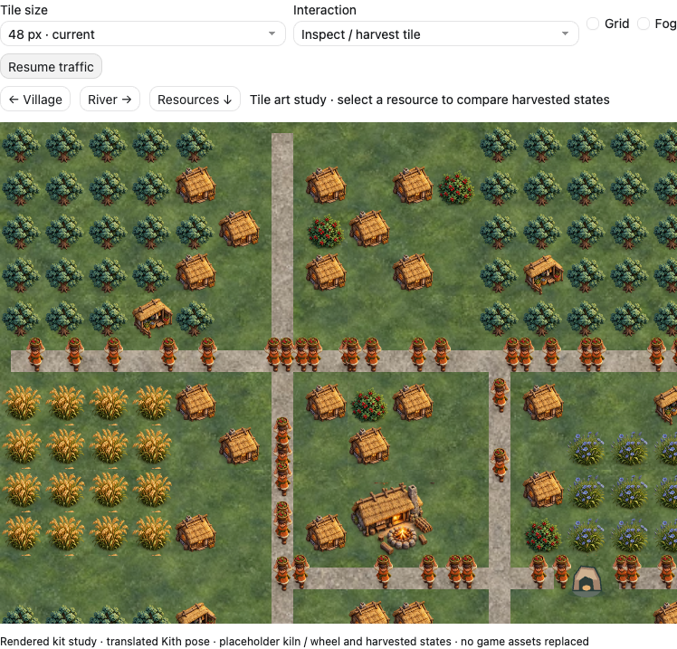
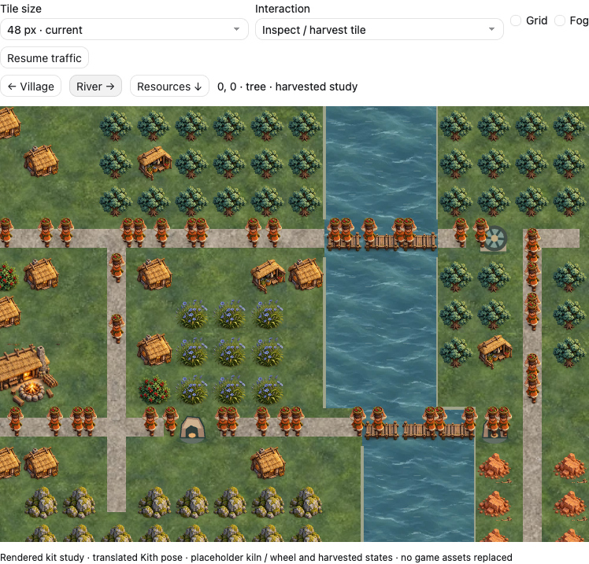
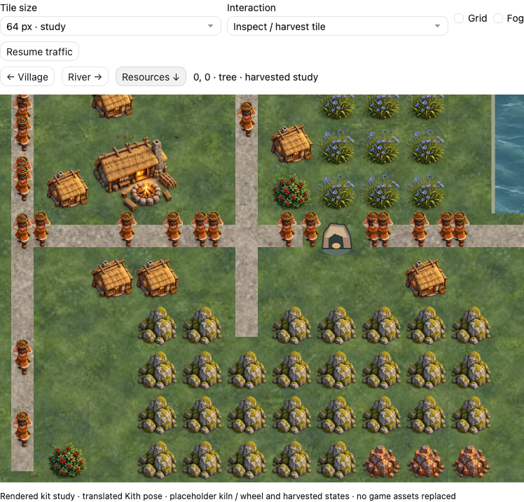
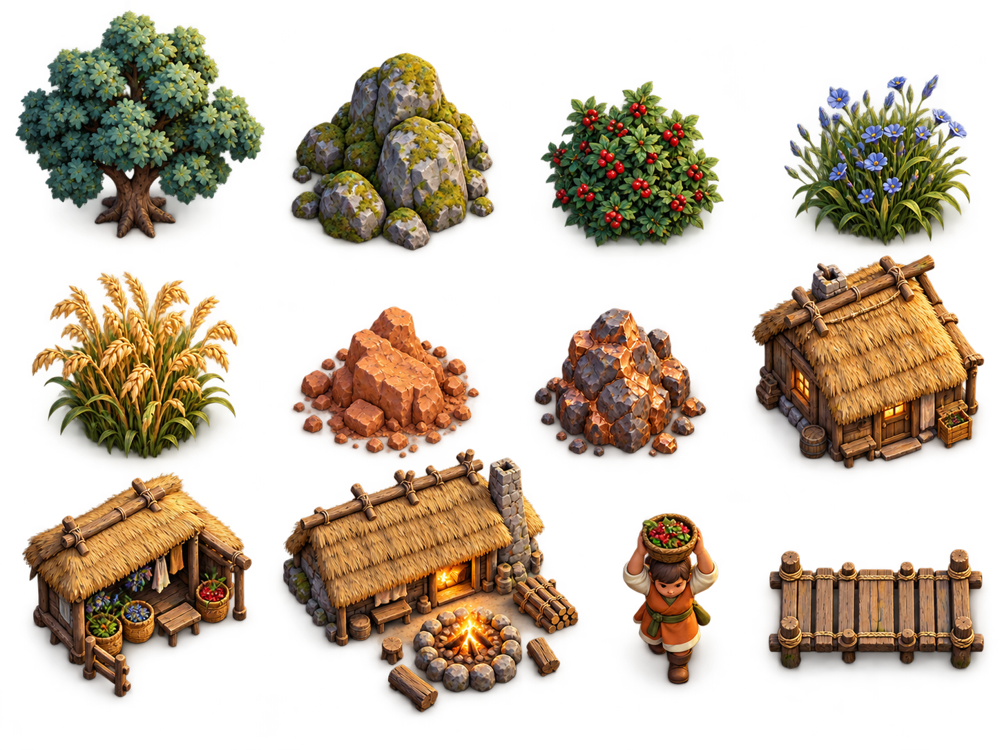

# Misty Highlands: rendered tile kit

2026-10-04, Codex. **Original direction studies; now implemented in the visual-overhaul branch.** the project owner prefers the miniature diorama rendering, misty highlands / twilight atmosphere, and sturdy stylized Kith. The earlier three SVG directions did not capture that intent. See the [Godot integration](engine/README.md) for actual engine captures, asset mappings and remaining limits. The images on this page are the earlier browser studies.

## Actual game constraints

Reviewed the project owner's 39-second gameplay recording: approximately 100 Kith, dense resource clusters, many adjacent buildings, orthogonal roads and bridges, continuous hauling, gathering ranges, and blocked placement feedback. The first scenic clearings failed to represent this density. This kit is assembled on a 24×16 orthogonal tile map, with a 48 px default and a 64 px comparison. Camera crops rather than scaling the whole map down. Every resource and building occupies explicit tile cells; the Hearth remains 2×2.

## Kit

The follow-up [coordinated variants study](variants/README.md) adds 40 subjects across six sheets and compares them together on the tile map. It also tests continuous grass, connected road masks and softly irregular riverbanks. The screenshots below retain the earlier single-subject study for comparison.

The atlas contains tree, stone, berries, blue-flowered fiber, grain, clay, copper ore, cottage, Gatherer's Hut, Hearth, Kith, and bridge. Grass, road earth and water are separate ground textures. Road earth is clipped to neighbor-connected orthogonal paths in the browser study. These are generated with the built-in image-generation tool; exact prompts are in [prompts.json](prompts.json). Original outputs are retained unmodified. Sprite rectangles are browser presentation metadata, not exported production sprites.

Direction: dimensional thatch and timber, sculpted mossy stone, cool green ground, readable warm clothing and fire. Keep the square placement model; avoid decorative square object plates. Quiet ground supports dense objects. Scale is still an evaluation, not an approved engine change.

## Original study limits (before engine integration)

- This is an art test, not an engine screenshot or a Godot playtest. The map is representative, not reconstructed from a save.
- The accompanying browser prototype has 64 illustrative road-following haulers, selection, fake resource-state toggles, placement previews, grid/fog toggles, and camera navigation. It does not implement gameplay. Kith uses one translated pose; there is no validated walk cycle or directional animation.
- Kiln, water wheel, harvested states and riverbank transitions remain simplified placeholders; road edges still use a simple geometric mask. The generated atlas has imperfect cell spacing and a three-quarter camera despite the more overhead prompt. Camera consistency, alpha edges, repeated variants, resource depletion semantics and spritesheet layout need a controlled production pass.
- Grass and water were requested seamless; exact edge continuity has not been proven. The browser tests repetition only. Production needs matched edge and corner tiles and a repeat/seam check.
- Production currently uses the SVG loader. The project owner authorized Codex to implement visual engine changes on 2026-10-04, including raster imports, atlas loading and rendered spritesheets; Claude reviews the resulting PR. These study PNGs remain isolated under the parent `.gdignore`. Prepare and validate production assets and metadata before adding them to the game.
- Treat animations as separate aligned directional sheets: shared anchors and sizes, restrained walk/work motion, separate fire/smoke, and reduced-motion support. Lighting and fog should remain separate layers rather than baked into every sprite.

The interactive study lives in the conversation. These source images and scale screenshots make the proposal reviewable without exporting the conversation surface into the game repository.

## Validation

Browser preview checks passed: assets loaded, pause holds, resource state toggles, occupied placement is blocked in the illustrative preview, camera navigation, 48/64 px sizing, grid/fog controls, no script errors, and no horizontal overflow at 338 px content width. These browser checks describe the original study. Engine behavior, imports and regression validation are now documented in the [Godot integration](engine/README.md). CI status is reported on the PR.
