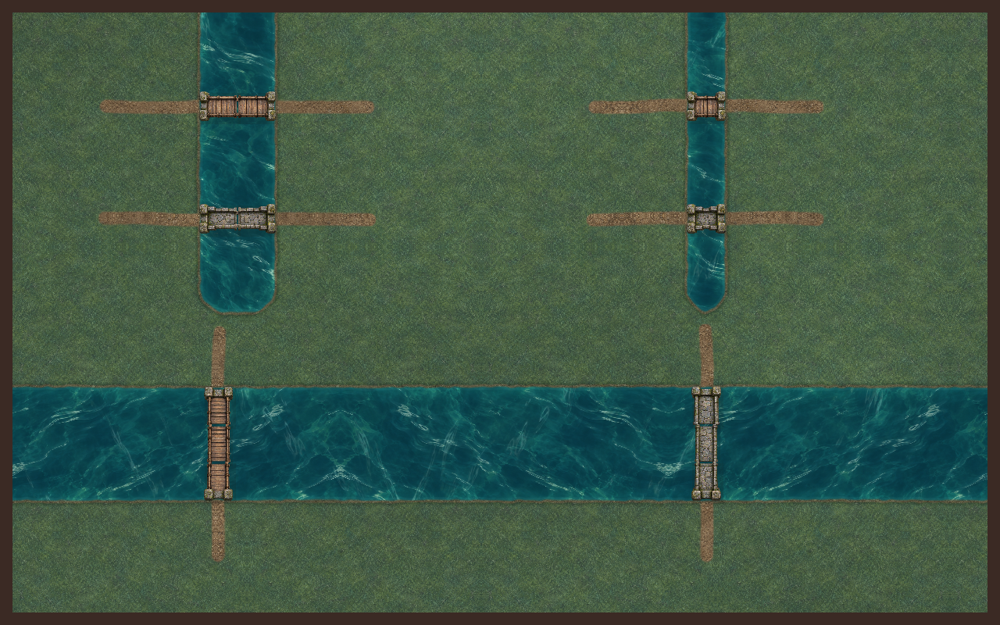
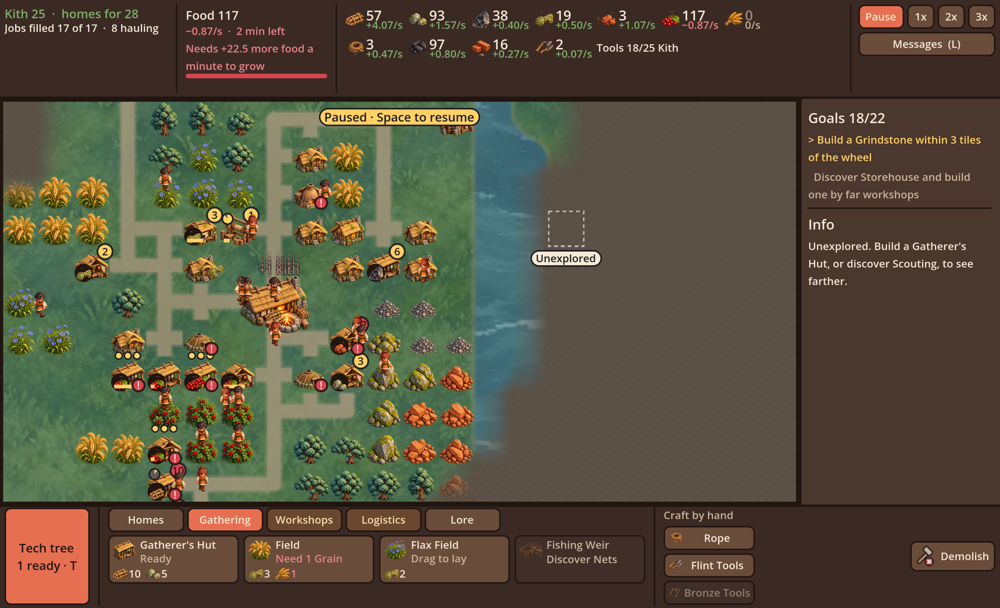
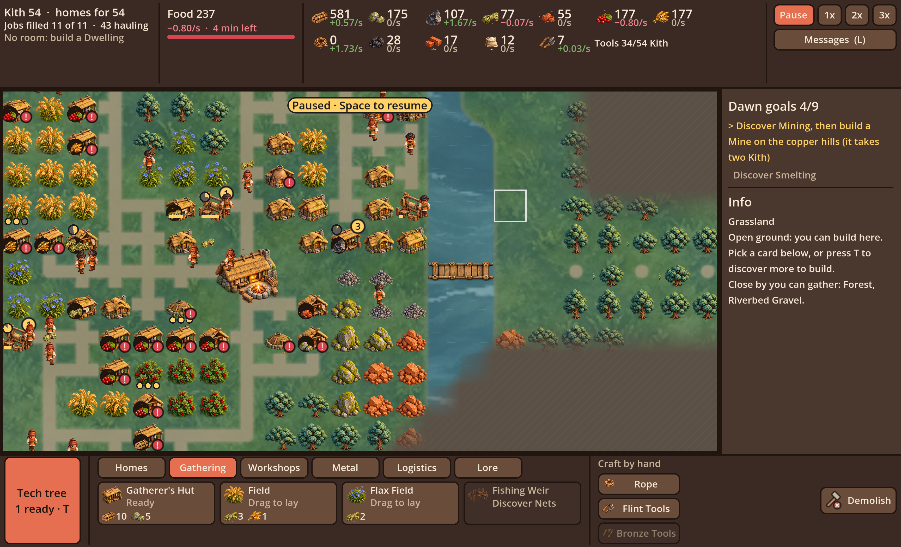
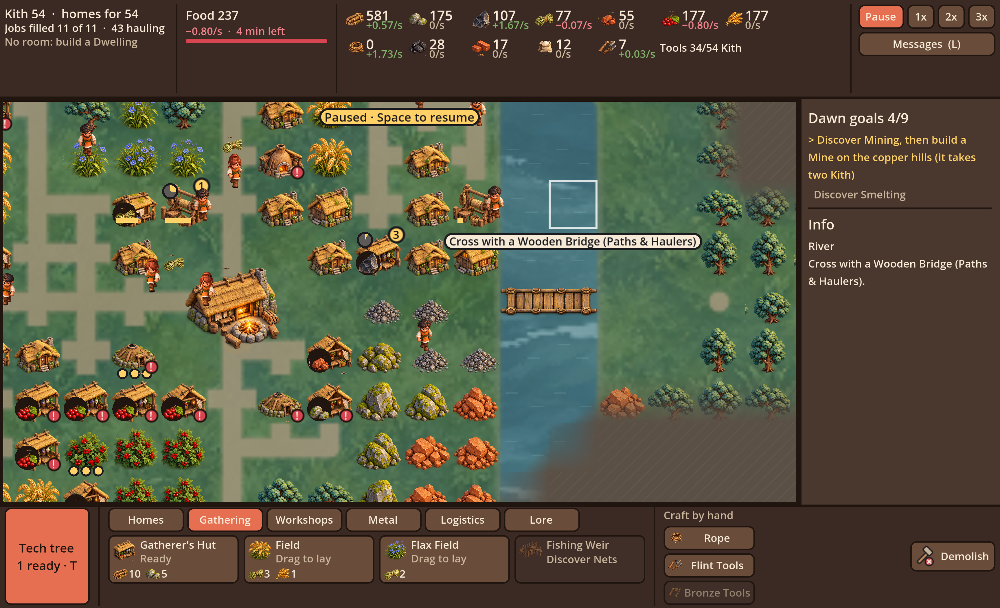
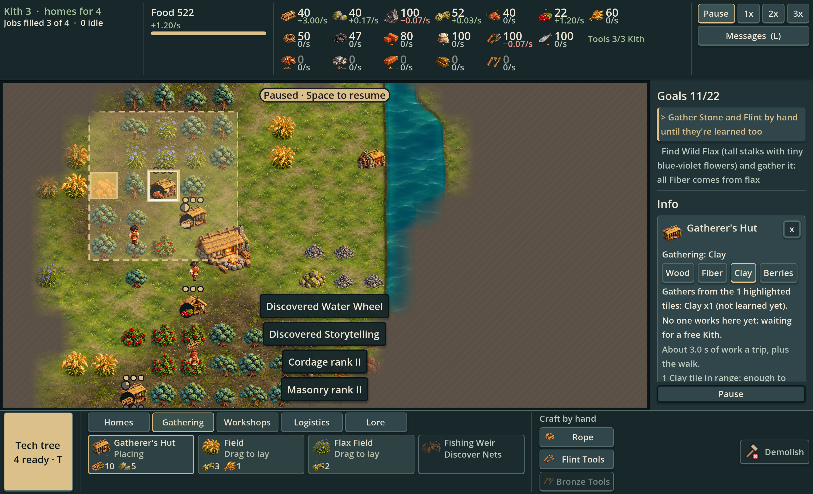

# Misty Highlands in Godot

Codex, 2026-10-04, PR #33. This pass implements the approved rendered miniature direction in the actual game. It retains the 48 px default, original placement cells, 2×2 Hearth, resource rules, simulation and saves.

## Implemented

- Transparent raster atlases replace map resources, core buildings, workshops, industry and all 18 item icons through the existing art interface. Legacy SVG fallbacks remain. New slots have Godot-generated import metadata.
- Trees, rocks, ore, plants, clay, dwellings, Gatherer's Huts and Hearths choose stable variants from map seed, coordinates and family. Three Kith appearances use stable names. Rendering never consumes simulation RNG.
- A cached world-space terrain mask drives a separate full-resolution material shader. Fine moss/turf, textured earth roads, damp irregular banks and layered flowing water replace the downsampled first pass. Mirrored material sampling and an offset second sample suppress texture seams. Roads join neighboring centers with small stable offsets. Hidden rivers and roads remain hidden until revealed.
- Four walking poses per Kith appearance animate at seven frames per second, with fixed cell anchors, side mirroring, existing work movement and actual carried-item icons. Cart operators draw the cart only when their gameplay state supplies it. Foliage moves subtly; working charcoal pits retain smoke.
- Placement ghosts, selection, gathering ranges, fog, camera zoom and UI callers keep their existing behavior. Terrain caching responds to road placement, discovery and world growth.

## Terrain and crossing revision

Jon rejected the first pass's blurry grass, flat water and roads, and stretched bridges. New original materials and exact prompts are in [terrain-prompts.json](../../../../../art/rendered/terrain-prompts.json). `world_ground.gd` now caches geometry masks; `terrain.gdshader` shades detail, flowing reflections, depth, shoreline and road texture on a separate child canvas beneath the map objects. All original generated PNGs remain unmodified.

`bridge_art.gd` assembles deck modules at fixed tile size. Wood/stone, horizontal/vertical and single-cell crossings have separate bank-end handling. Interior pieces repeat without stretching an entire bridge or repeating bank posts. Below is a staged renderer fixture, distinct from the gameplay screenshots.

## Actual game captures

The screenshots below come directly from Godot's main scene, played by the existing pacing bot. They are gameplay renders rather than browser compositions. No decorative scenery or fabricated resource layout was added for these captures.

## Validation and limits

Visual regression tests cover deterministic variation, atlas bounds, cache reuse, road invalidation, discovery privacy, unchanged world data and independent simulation RNG. Full logic goldens, strict Godot warnings, lint, formatting, and graphical play/layout passes validate integration; final CI status lives on PR #33.

This is the first integrated pass. The four-pose walking loop is not a full directional animation rig. Fire is part of the generated Hearth art; full layered fire animation, directional work cycles and water-wheel rotation remain polish work. Unique workshops and industry currently have one appearance each. Terrain materials now render at viewport resolution rather than being baked into a low-resolution ground image. Logical road topology remains orthogonal; its shape and material are softened without changing pathing. Further biome and environmental art can extend this base. Tile-based fog remains visible at the exploration frontier. No global tile-scale change was made.

Sources and exact generation prompts: [art/rendered](../../../../../art/rendered/README.md).

## Blended grounding test

Actual main-scene captures of the 2026-10-05 playable terrain and interface pass, staged with the existing pacing/layout bots. The game draws new meadow, woodland and calmer water materials through world-space masks, foundation aprons and tight contact shadows; these captures are not AI paintovers. Tree density is derived only from revealed terrain. Ground refreshes with clearing, demolition and discovery.

The [review paintovers](../grounding-studies/README.md) include decorative shoreline details beyond this first runtime pass. No new biome rules, map-generation logic, global scale change or road-through-building mechanics are implemented. The existing route semantics still apply. Native interface surfaces now use quiet charcoal green, ivory, brass, moss and ember; [specification and UI captures](../../../../design-system/mockups/miniature-interface.md).

Validation: strict editor warnings on 117 scripts; import/metadata; GDScript lint and format; visual regressions and UI behavior/contrast; graphical input pass to Bronze Dawn (5,280 frames, 17.9 simulated minutes); layout pass (1,015 HUD checks, 20.5 simulated minutes, zero scale changes/problems). CI status is on PR #33.
