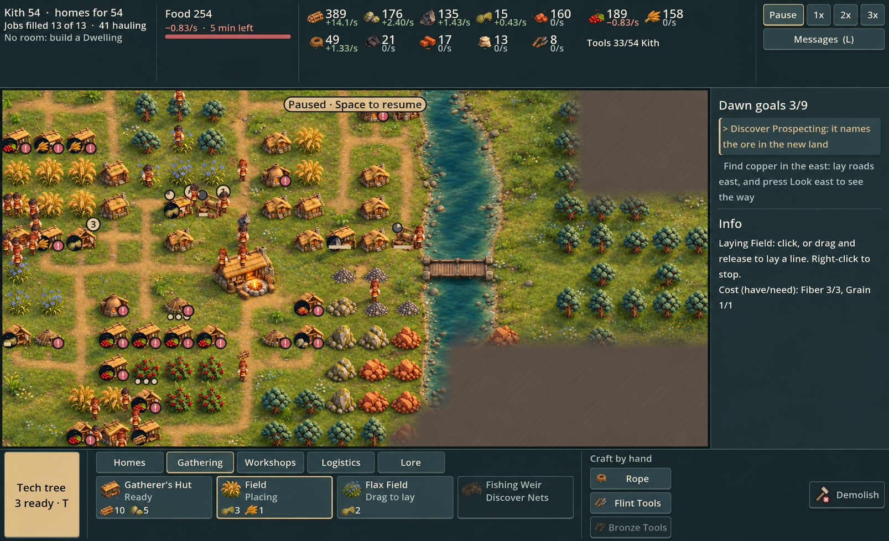
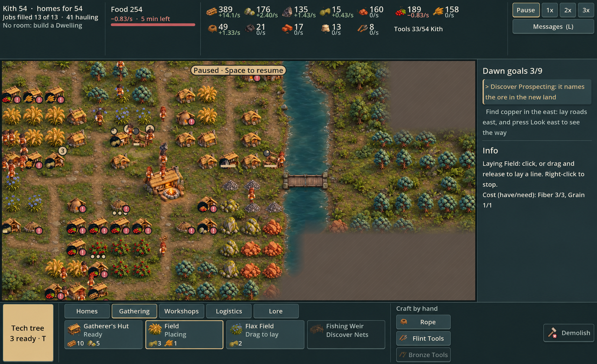
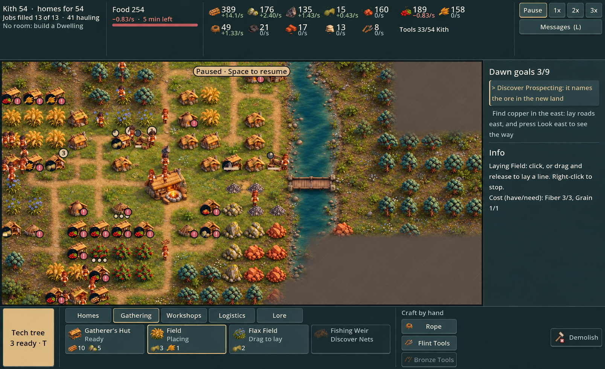
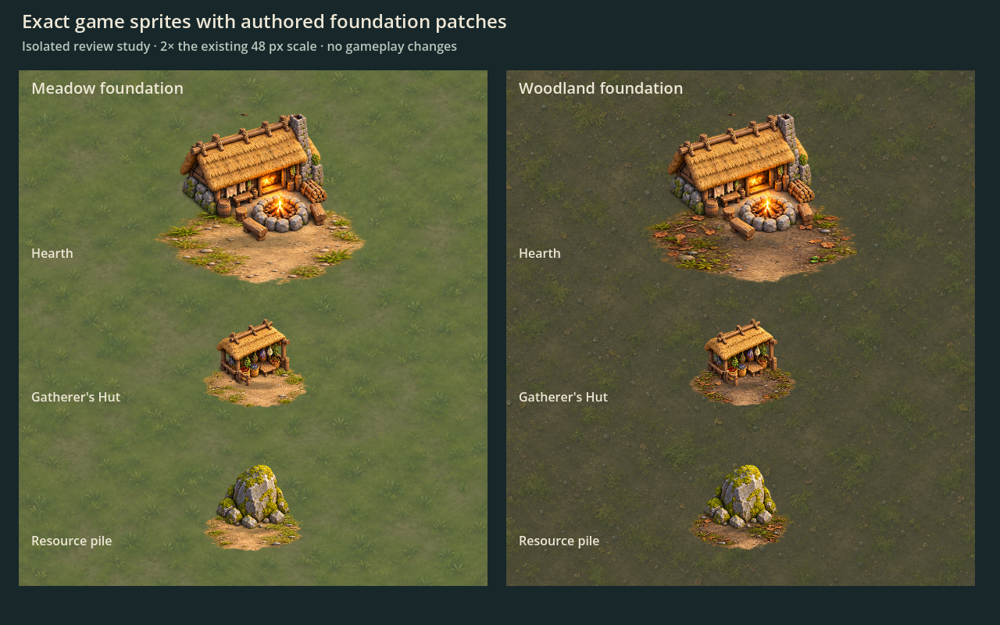

# Grounding studies — review before integration

Jon rejected the latest terrain test on 2026-10-04 because its scale did not match the approved subjects and buildings/resources still appeared to float. Codex reverted that experiment’s production terrain code and moved its assets out of `art/`. The prior terrain renderer remains in place.

These are AI paintovers of the same actual game view, made with the built-in image generation tool. They compare relationships of subject scale, ground detail, contact shadows, entrance aprons, path verges and riverbanks. They are not gameplay screenshots or pixel-exact sprite composites: image generation changes some subject details and adds small decorative plants/stones. Approval would establish terrain direction, not make every painted detail a promised engine feature.

## 1. Quiet meadow

Lower vegetation, subdued sage grass, worn ground around foundations, softer walking paths and a shallow stony bank.

## 2. Worn woodland floor

More exposed soil, small moss islands, quieter darker paths and deeper shaded water. The warm buildings stand out against the cooler ground.

## 3. Blended landscape regions

Jon liked both treatments and asked to explore biomes. This review study combines meadow around the settlement, woodland floor beneath existing tree groups, and damp shoreline ground. Irregular transitions, local road materials, entrance aprons and contact shadows connect the treatments within one map.

The study explores visual regions only. It does not establish biome resource rules, new map-generation mechanics or canon. As with the first two paintovers, some subjects and decorative details drift from the source screenshot.

## Playable translation (2026-10-05)

After reviewing the blend, Jon authorized a playable terrain test. The renderer now combines new small-scale meadow and woodland materials, forest-density masks derived from revealed trees, damp riverbanks, calm flowing water, worn foundation aprons, local road coloration and tight subject contact shadows. This translates the reference into independent rendering layers; it does not display a baked paintover as the game map.

See the [actual Godot captures](../engine/README.md#blended-grounding-test). These visual regions are not biome gameplay rules. Decorative shoreline reeds/pebbles painted in the reference are not yet separate runtime subjects. Functional road-through-building connectivity remains a gameplay handoff request.

Preserve gameplay tiles, pathing, resource layouts and the approved subject art. The review paintovers above remain concepts, distinct from the actual captures.

Exact prompts, tool and source paths: [prompts.json](prompts.json).

## Isolated foundation study (2026-10-05)

The playable translation fell short of the paintover; PR #33 remains in draft. This next study composites the exact production Hearth, Gatherer's Hut and rock sprites in Godot with generated transparent foundation patches, at twice the existing 48 px tile scale. It is an isolated native preview, not a gameplay capture.

The patches improve contact but retain visible edges. They are review-only, are not loaded by the game, and do not resolve whole-map terrain, water or road continuity. The atlas is preserved unchanged from image generation; provenance and prompt are in [foundation-patches-prompts.json](foundation-patches-prompts.json).

## Withdrawn material experiment (2026-10-05)

Jon rejected the flatter native terrain/water comparison. [Review-only experiment and explanation](terrain-refinement/README.md) are retained; production was restored to the pre-experiment renderer. The blended paintover above remains a concept target, not a prior playable result.

## Sculpted native study (2026-10-05)

[Actual Godot previews at 48 px and existing 64 px zoom](sculpted-native-study/README.md) use authored moss relief, jade water and irregular rendered bank dressing. This is an isolated renderer study with the real main scene; production terrain is unchanged. The richer paintover remains the target and is shown separately for comparison.
