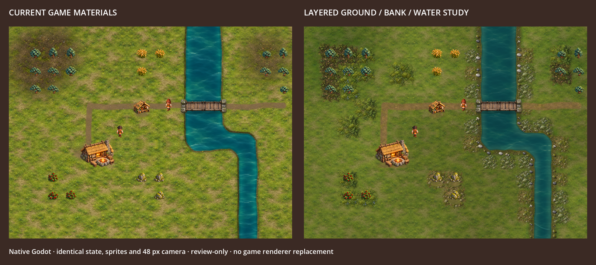

# Layered terrain beauty slice

Codex, 2026-10-05. Review-only native Godot experiment on `codex/terrain-beauty-slice`. Normal play, production art and the renderer are unchanged.



Left: production ground/material renderer in a controlled fixture. Right: layered experiment. Both panels share the same 16×12 world, 48 px camera, subject assets/positions, road grid and fixed poses. Both use the earlier review bridge module renderer to hold its geometry constant. This is a synthetic comparison fixture, not an AI paintover or a screenshot of an actual saved settlement.

## What changed

- Quiet base material with broad value variation, leaving room for clustered detail.
- Independent transparent moss/soil/pebble patches placed around revealed trees, resources and river edges. The original generated atlas stays unchanged. Native source regions and a shader feather edges, suppress detail over water, roads and worn foundations.
- Broader moss/damp-soil transitions, larger rounded bank props, jade shallow/deep water with restrained painted ripples and sparse moving highlights.
- Worn ground aligned beneath the 2×2 Hearth’s bottom-anchored foundation/fire. Approved subject assets, tile identities and gameplay footprints stay fixed.

The patch layer is separate from terrain and shore/subject drawing. This controls where detail appears rather than baking all detail into a repeated ground image. The shader/placement code is deliberately isolated here for review, not an export-ready or performance-approved production pipeline.

## Result and remaining gaps

The native result gives tree/resource clusters a shared ground context and broadens bank detail while preserving quieter clearings. It remains short of the concept target: river/road geometry is still strongly orthogonal, patch repetition and border density need refinement, and the scene needs stronger authored composition/light. The prototype does not establish visual approval or justify replacing the game terrain yet. Fog edge suppression intentionally reduces decoration near unknown cells.

## Verification

Graphical 1616×720 native capture completed without engine errors/warnings and asserted an unchanged world. Focused checks pass: 42 contextual patches, all six families, source bounds and real atlas transparency, deterministic placement, correctly positioned Hearth contact, unchanged world/fog/RNG, and no patches extending into unrevealed neighbors. GDScript lint/format and diff checks pass. These files sit beneath the review directory’s `.gdignore`; normal imports do not create new runtime metadata for them. Repository CI is reported on the PR separately.

Exact built-in imagegen prompt/source and processing are recorded in `prompts.json`. The atlas is copied without pixel editing; all feathering/clipping happens in Godot.

```sh
/Applications/Godot.app/Contents/MacOS/Godot --path . --windowed --resolution 1616x720 --fixed-fps 60 --script docs/art/overhaul/misty-highlands/grounding-studies/beauty-slice/capture.gd
/Applications/Godot.app/Contents/MacOS/Godot --headless --path . --script docs/art/overhaul/misty-highlands/grounding-studies/beauty-slice/check.gd
```

Capture output: `/tmp/solace-beauty-comparison.png`. No simulation is advanced between panels.
