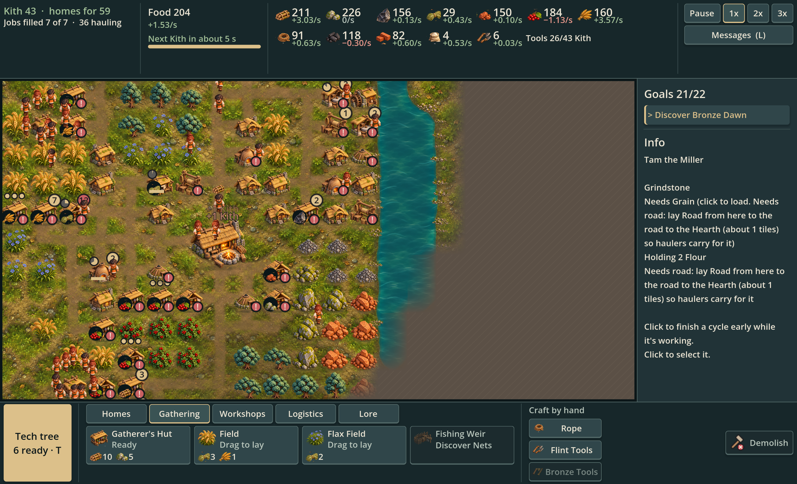
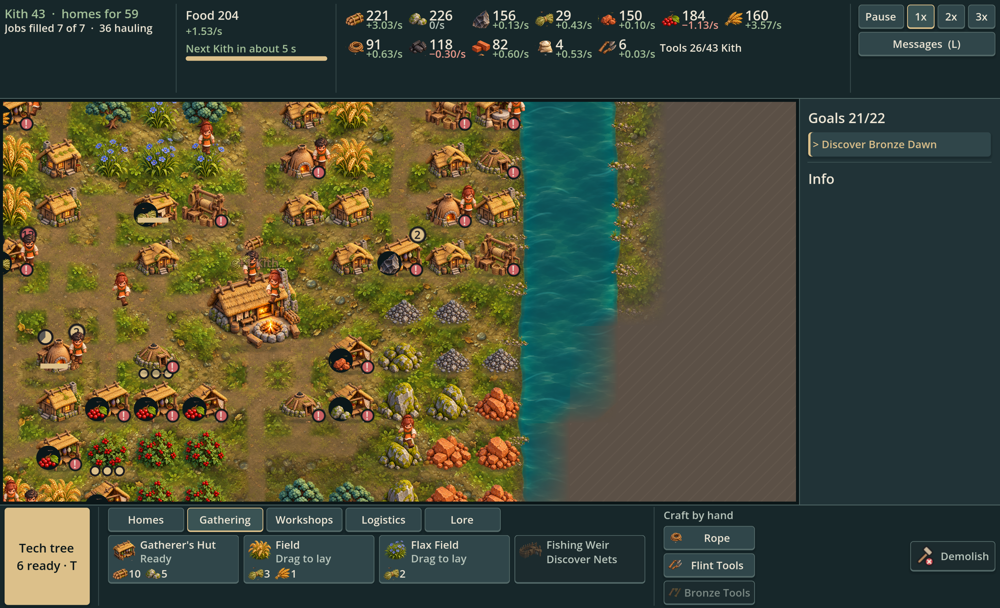

# Sculpted terrain — isolated native study

Codex, 2026-10-05, draft PR #33. Jon confirmed the richer blended paintover as the target after rejecting the flatter material experiment. This study tests that direction through Godot's actual main scene without changing the production renderer.

## Native output at the normal scale



## Existing closer camera view



Both are **native Godot screenshots**, not AI paintovers. The existing pacing bot develops the real map; production buildings, Kith, resource sprites, bridge, UI, fog and road topology are retained. The isolated capture script swaps only its own terrain renderer instance. The 64 px image uses an existing zoom step; no global tile-scale change was made. Bot stocks/progression are not balance proposals.

## Concept target


The target has a more carefully composed riverbank and softer, coherent local ground than the native study. The native output restores authored moss relief and richer water, but ground repetition, orthogonal road shapes and the composition of bank clusters remain visible. This is a review candidate, not a claim that the target has been matched.

## Rendering approach

- A new unchanged generated ground material retains upper-left relief around moss islands and embedded pebbles. It is sampled directly rather than averaged into flat lawn texture.
- Continuous masks still derive from real revealed tree groups, roads and building/resource positions. Local wear connects subject bases to soil; shoulders sample neighboring cells rather than clipping to tile borders.
- Six transparent rendered stone/reed clusters share the subject art's lighting. Stable coordinate/edge hashes vary their count, size and placement, and inset them into the bank. Both water and adjacent land must be revealed.
- Jade water keeps depth, curved reflections and restrained moving glints. Reflections animate independently of simulation.

Nothing in this folder is loaded by normal play. The parent `.gdignore` excludes these review files from game import. Production art, code, tests, gameplay and saves remain unchanged by this study. Review before proposing integration.

## Reproduce and validate

From the project root with Godot 4.7.2:

```sh
mkdir -p /tmp/solace-sculpted-native
godot --path . --windowed --resolution 1280x800 -s docs/art/overhaul/misty-highlands/grounding-studies/sculpted-native-study/capture.gd
godot --headless --path . -s docs/art/overhaul/misty-highlands/grounding-studies/sculpted-native-study/check.gd
```

Capture saves the two PNGs under `/tmp/solace-sculpted-native/`. The isolated checks cover atlas bounds, discovery privacy on both sides of the bank, stable placement, world/RNG independence, road-to-destination continuity and removal of resource contact after clearing. Final native capture/check logs are inspected for engine errors before publication; production CI remains a separate check on the draft PR.

Sources: [exact built-in imagegen prompts and unchanged PNG provenance](prompts.json), [capture script](capture.gd), [study renderer](study-ground.gd), [material shader](study-terrain.gdshader), [checks](check.gd).
