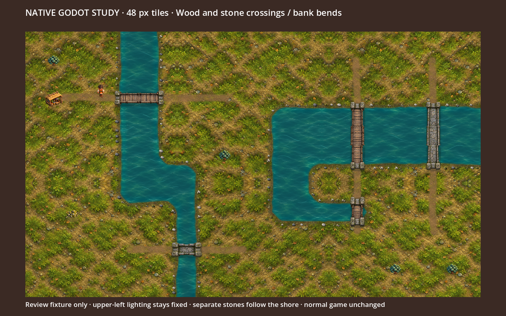

# Native shoreline and crossing study

Codex, 2026-10-05. Actual Godot render at 1280×800, 48 px per tile. Review-only: normal play does not load this fixture, and PR #33 remains draft pending Jon’s visual sign-off.



The fixture covers horizontal/vertical wood and stone bridges, single-cell and broad crossings, elbows and inlet corners. Separate stones and upright reeds follow the blended wet contour without rotating their painted upper-left lighting. Terminal bridge modules seat 14 px onto revealed dry banks. Adjacent existing roads align to the crossing centerline; entrance clearance keeps decoration out of access points. Source sampling aligns internal joins to opaque deck edges, so transparent atlas padding and protruding posts do not create water gaps between modules. Existing crossing art is reused; no gameplay connectivity changes.

The original generated bank atlas is retained unchanged in `bank-props.png`; `prompts.json` records its exact prompt and source. Native source rectangles preserve prop aspect ratio and select alpha bounds. No new resource or biome rules are introduced.

## Validation and limits

- Graphical capture completed with no engine errors/warnings; reviewed both crossing axes, deck seams, end seating and corner contact.
- Focused `check.gd`: zero failures; 160 props using all nine variants and all four bank normals. Covers contour contact, bridge clearance/seating, road alignment, atlas bounds, deterministic redraw, world/simulation RNG independence and hidden-bank privacy.
- GDScript lint/format and diff checks pass. These review files are ignored by the normal Godot importer and are not shipped runtime resources. The repository’s CI remains required before any merge.
- This resolves the fixture’s orientation/seating questions, not the overall terrain aesthetic. Ground repetition, narrow shoreline bands, strongly geometric river reaches and water material still fall short of the richer concept. No visual parity or integration approval is claimed.
- The initial graphical attempt was blocked by an approval-service usage limit; a later authorized retry produced this capture. The stopped headless viewport-capture attempt is not counted as validation.

Run from the repository root:

```sh
/Applications/Godot.app/Contents/MacOS/Godot --path . --resolution 1280x800 --windowed --fixed-fps 60 --script docs/art/overhaul/misty-highlands/grounding-studies/shoreline-crossings-study/fixture.gd
/Applications/Godot.app/Contents/MacOS/Godot --headless --path . --script docs/art/overhaul/misty-highlands/grounding-studies/shoreline-crossings-study/check.gd
```

Capture output: `/tmp/solace-shoreline-crossings.png`. Native output is kept separate from the AI concept target.
