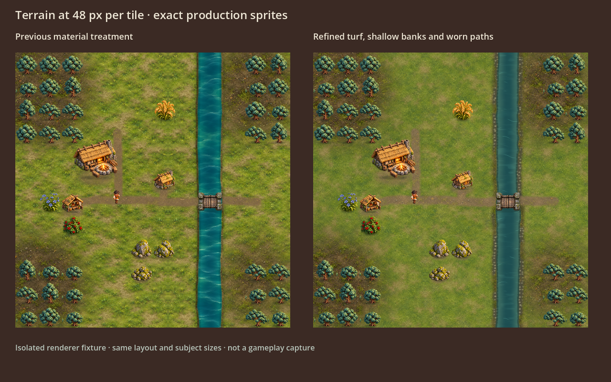
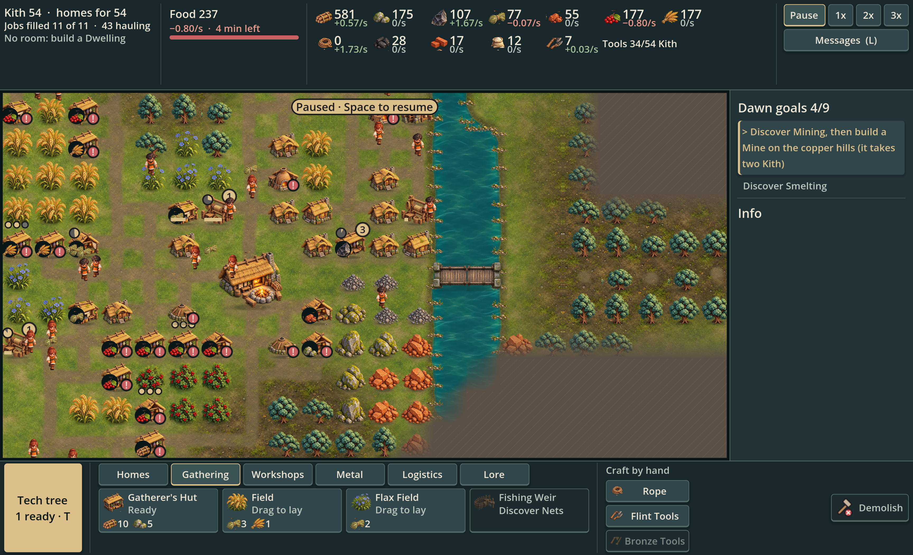

# Withdrawn terrain experiment — 2026-10-05

Codex attempted quieter turf, procedural bank stones and flatter water. The project owner found the native result a significant step back from the richer blended paintover. The experiment was withdrawn before commit or publication; production renderer/art/tests were restored to `36239f3`.

The [blended paintover](../blended-regions.png) remains the target. It is AI concept art, not a previous working game render. Its globally composed banks, ground relief, shadows and water have not yet been reproduced at that quality in the playable renderer.

## Intermediate native comparison

Exact production sprites at 48 px per tile, staged native fixture. The flatter water and procedural tiny stones were rejected. This is not a gameplay capture or an approved alternative.

## Follow-up candidate, still not approved

A subsequent temporary main-scene test added transparent rendered stones/reeds and restored richer water. The bank clusters still look too evenly spaced and the ground remains less sculpted than the concept. This candidate was also moved out of the game. No claim of visual parity or final validation is made.

Review-only code/materials and [exact generation prompts](prompts.json) are kept here under the parent `.gdignore`; none is loaded by the game. Existing UI/research work and approved subject art were retained. The next terrain study must compare native output explicitly against the concept before proposing integration.
