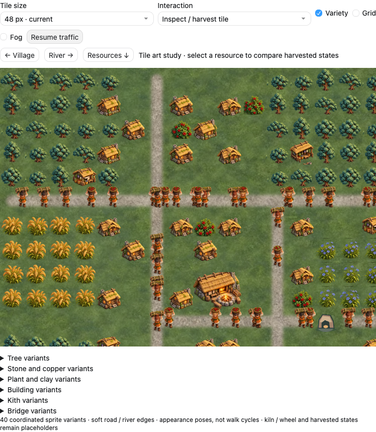
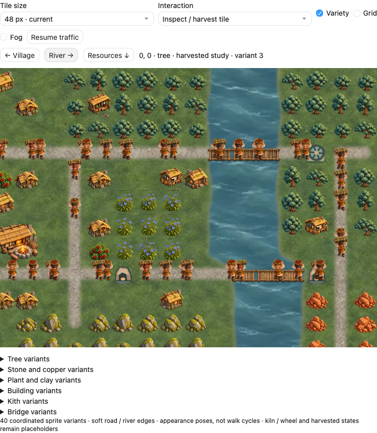
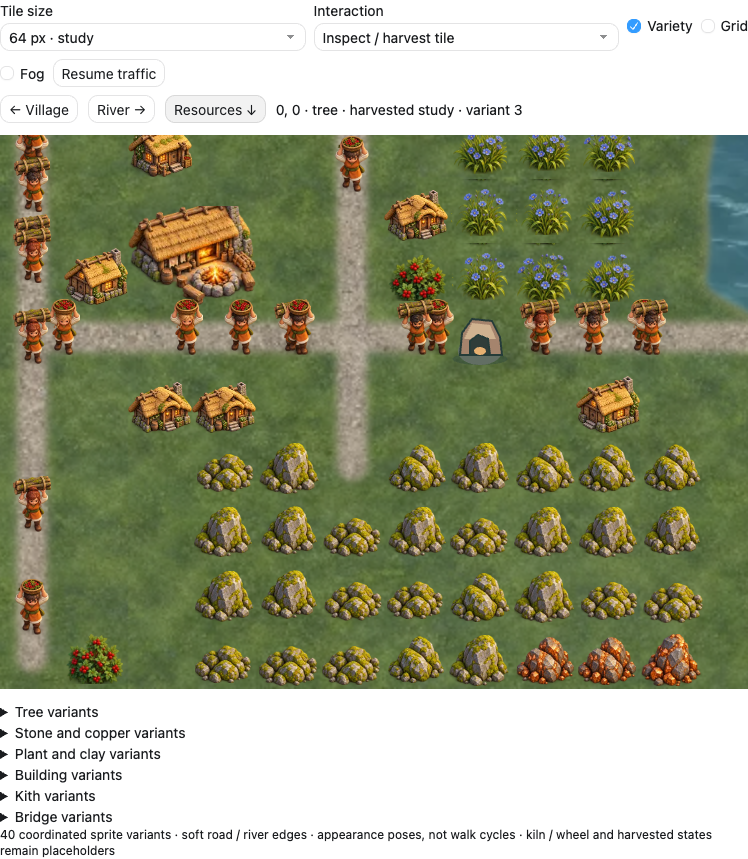

# Misty Highlands: coordinated tile variants

2026-10-04, Codex, PR #33. Documentation-only art studies following Jon's request for varied assets that blend naturally on the tile map. These extend the [rendered miniature kit](../README.md), with no production sprite replacements or engine changes.

## Shared family, varied silhouettes

| Sheet | Variants | Layout |
| --- | --- | --- |
| [Trees](trees.png) | 4 crowns and trunks | 2 columns × 2 rows |
| [Rocks](rocks.png) | 3 mossy stone, 3 copper ore | 3 columns × 2 rows |
| [Plants and clay](plants.png) | 3 each: berries, flax, grain, clay | 3 columns × 4 rows |
| [Buildings](buildings.png) | 3 each: cottage, Gatherer's Hut, Hearth | 3 columns × 3 rows |
| [Kith](kith.png) | 6 appearances carrying wood or berries | 3 columns × 2 rows |
| [Bridges](bridges.png) | 3 timber treatments | 3 columns × 1 row |

The 40 subjects share cool foliage, warm timber/thatch, soft contact shadows and a common camera and light direction. Shapes and material details vary within each family. No square ground plates are added to resources. Original image-generation outputs are retained unmodified; [exact prompts](prompts.json) and [presentation crop metadata](crop-metadata.json) accompany them. The metadata finds alpha bounds within each sheet cell; it is not a validated production atlas specification.

## Map assembly

The conversation study assigns variants deterministically from tile coordinates and a family seed. Kith appearance follows a stable unit ID. Selection stays fixed when the camera moves, the map resizes or the grid is shown. Small resource offsets and scale differences soften repeated rows while retaining each occupied cell; Hearths stay 2×2. A Variety control compares the mixed family with a repeated first variant.

Grass is sampled across a continuous world plane, with a second offset sample and low-contrast broad color patches. Road masks connect neighbor centers before receiving a feathered edge, so junctions do not reveal independent square plates. The river uses one continuous mask with gently irregular banks and a softened bend; water continues underneath crossings. A crossing selects one bridge treatment across its span. These are browser presentation techniques and a proposal for Claude's terrain renderer, not code added to the game.

## Production limits

- This is a representative tile-map art test, not a screenshot of Solace running in Godot. The 48 px view is the current-scale comparison; 64 px remains exploratory.
- Kith appearances are translated single poses, not directional walk or work frames. A real animation sheet still needs aligned anchors and consistent poses.
- Bridge end posts repeat across adjacent segments. Production needs separate deck, bank ends and rail continuations. The river contour is an illustrative continuous shape; a general terrain system needs masks or matched edge/corner tiles for arbitrary maps.
- Generated alpha edges, camera consistency, shape bounds, exact ground texture repeat seams and semantic distinctions between building roles require a controlled production pass. Kiln, wheel and fake harvested states still use simplified placeholders; harvest toggles do not propose resource depletion rules.
- All raster studies remain isolated by the parent `.gdignore`. Production's SVG contract and imports stay unchanged pending Claude's pipeline review.

## Validation

The isolated browser preview loads all six families and three terrain textures without script errors. Mixed and uniform renders differ, and restoring mixed variants returns the same paused image. Camera navigation, 48/64 px sizing, grid/fog, illustrative state toggles, blocked placement feedback, pause and reduced-motion defaults pass. The layout has no horizontal overflow at 338 px content width. The village, river and resource screenshots were inspected together for common style and readable tile occupancy.
