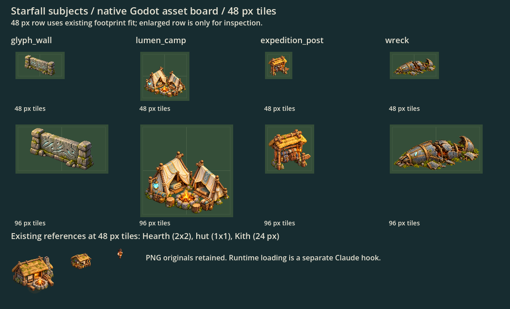

# Starfall map buildings

Codex, 2026-10-06. Four current-slot subjects from the [Starfall brief](../starfall-art-brief.md). This is an art/import handoff, not gameplay wiring. Original PNGs are unchanged built-in imagegen outputs; prompt/reference/source provenance is in [prompts.json](prompts.json).

The top row uses the actual 48 px tile scale and existing aspect-preserving, bottom-centered `Rendered.fit` behavior. The second row doubles the tile size for inspection. Existing Hearth, hut and 24 px Kith below show the intended scale and style. This is a **Godot asset board**, not a screenshot of wired Starfall gameplay.

| Existing ID | Production PNG | Logical footprint | Visible source region |
|---|---|---|---|
| `glyph_wall` | `art/rendered/starfall-glyph-wall.png` | 2×1 | 112, 318, 1061, 707 |
| `lumen_camp` | `art/rendered/starfall-lumen-camp.png` | 2×2 | 162, 272, 977, 713 |
| `expedition_post` | `art/rendered/starfall-expedition-post.png` | 1×1 | 146, 122, 1059, 1026 |
| Wreck | `art/rendered/starfall-wreck.png` | existing roughly 2×1 visual extent | 80, 110, 1647, 667 |

Machine-readable source sizes, regions and footprints: [regions.json](regions.json). Regions use alpha greater than 0.05 plus four source pixels of padding, ignoring almost invisible generator specks. The PNGs and original alpha are preserved, not rewritten or upscaled. Every region is within the source image. Each image is one subject; none requires an atlas-layout guess.

## Appearance

- Glyph Wall: broad smooth stone face on low end supports, restrained cyan in nonalphabetic scratched marks. These marks are decorative; the real twenty glyph symbols remain code-drawn and unchanged.
- Lumen Camp: ivory and pale-gold travelling tents, carried bundles, a small amber campfire and cyan shard lantern. Existing camp proximity/trust behavior stays with Claude.
- Expedition Post: warm Kith pack rack, thatch awning, oversized packs/rolled blankets, amber lantern and an unlettered trail arrow. The rack silhouette replaces the current Watchtower borrowing.
- Wreck: low broken matte blue-grey hull with weathered bronze ribs, sparse close grass and warm embers. No baked smoke or tall flame; keep animated smoke/flare separate. No additional spacecraft lore or capabilities are implied.

All use the production buildings as camera/light/material reference, transparent background and tight contact details. No square soil plate, labels or text. Light in these PNGs is restrained accent color, not a replacement for the engine's optional glow layer.

## Claude loading/anchor contract

No original atlas, asset ID, footprint, renderer file, gameplay or save rule changed here. Normal gameplay still loads the placeholders until this hook is implemented.

For the three buildings, the existing `Rendered.REGIONS` / `SINGLE_BUILDINGS` pathway can use the corresponding standalone image as a sheet with one region (index 0), preserving `glyph_wall`, `lumen_camp` and `expedition_post` IDs. Cache via `Rendered.sheet`/`sprite`, and retain `Rendered.fit(..., box.grow(-1))`; do not scale from the full PNG's transparent canvas.

For `KithArt.draw_wreck`, retain `wreck_found`, valid-coordinate and revealed-tile checks exactly. Preserve the current center `(wreck + Vector2(0.5, 0.5)) * Overlays.TILE`. Fit the region in a centered approximately 96×48 visual box at the 48 px base scale, with existing embers/smoke as separate layers and without double-drawing the old hull. The Wreck remains an event landmark, not a placed building or a changed occupancy rule. The Shard Cairn is untouched.

After hooking, inspect all subjects on an actual revealed map at 48 px, including menu/build-card icons and Wreck fog privacy; passing this asset PR's CI alone does not prove those unwritten hooks.

## Validation

Godot 4.7.2 generated four `.import` files. The checked graphical preview loads imported textures (not raw source images), verifies alpha/nonempty subjects, measures bounds and captures the board without application warnings/errors. The known OpenGL 2D-MSAA warning is exempt under the repository runner. Reproduce with `-s docs/art/starfall-buildings/preview.gd`; `.gdignore` excludes this documentation fixture from asset imports. Full CI status is on the PR.

Remaining groups: Lumen strangers/party pack, pack/Shard icons, glyph-set/gift emblems, moment/ending pictures and first Bloom sign. Later Guard Post/shrine/trade stall and later goods remain deferred per the brief; beast canon remains pending.
