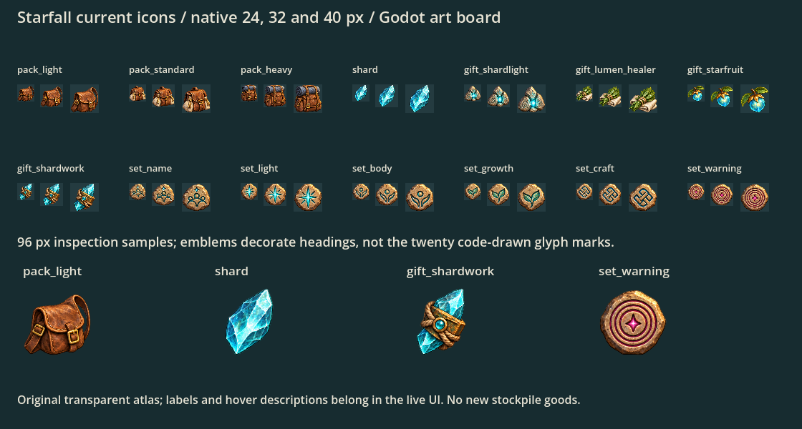

# Current Starfall icons

Codex, 2026-10-06, PR #72. Fourteen current illustrations from the [brief](../starfall-art-brief.md), in one original transparent PNG: three packs, Shard, four gifts and six set emblems. No new stockpile goods or technologies.

The top samples are actual 24/32/40 px draws; the bottom is 96 px inspection. This is an asset fixture, not a wired research/picker screen. The Warning has three separate carved rings. One targeted imagegen correction added the third ring; [both prompts and source provenance](prompt.json) are retained. Final tool output is copied unchanged, with Godot-generated import.

## Regions and caller mapping

Use [regions.json](regions.json), **not uniform grid crops**: some subjects extend over nominal cell edges. The preview locates each subject's alpha-connected component from its cell center (alpha >0.05), then adds four source pixels. This keeps the complete pack/leaf silhouettes and excludes neighbor fragments. Raw PNG/alpha remain unchanged.

| Region IDs | Existing caller/state |
|---|---|
| `pack_light`, `pack_standard`, `pack_heavy` | `Starfall.PACKS` keys `light`, `standard`, `heavy` in Expedition Post/picker |
| `shard` | existing Strange Stone/Shard visual, card/landmark accents; no new resource ID |
| `gift_shardlight`, `gift_lumen_healer`, `gift_starfruit`, `gift_shardwork` | `Starfall.LUMEN_GIFTS` keys `light`, `body`, `growth`, `craft` |
| `set_name`, `set_light`, `set_body`, `set_growth`, `set_craft`, `set_warning` | six existing `GLYPH_SETS` heading IDs, in order |

## Claude hooks

Cache the PNG and measured AtlasTexture regions through the existing visual loader; use aspect-preserving drawing in the caller's current icon box. The emblems illustrate **headings**: do not replace `GlyphMark`'s twenty meaningful symbols or reveal hidden glyph answers. Warning uses `set_warning`, not a fifth gift or new tech. Keep the Shard Cairn map sprite and its runtime glow unchanged.

Hover/focus descriptions must identify each illustration using the current pack/gift/set name. Pack controls retain their real material cost and affordability semantics; the art is not a new stockpile pack good. Shard aliases must preserve the current caller's item name. Do not invent the later third-tab technologies from this sheet.

Normal play still uses existing icons until Claude wires these callers. Local checked import, fourteen bounded transparent-subject measurements and inspected native UI sizes passed; full CI and live UI/tooltip inspection after wiring remain required. Reproduce with `-s docs/art/starfall-icons/preview.gd`; `.gdignore` excludes the fixture from imports. Later cloth/lamp cage/Bloom sample goods and unlisted third-tab techs remain deferred.
