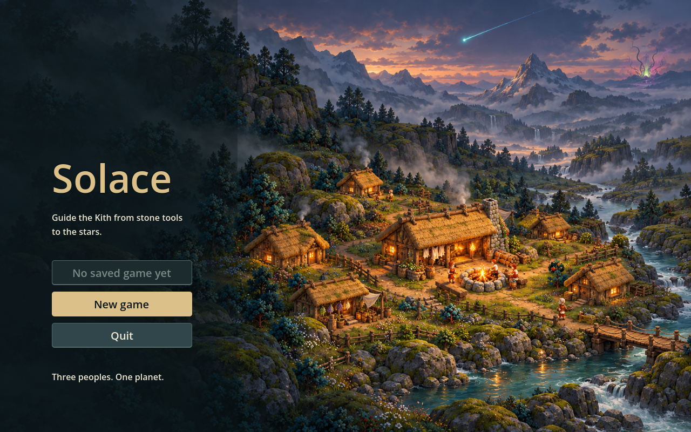
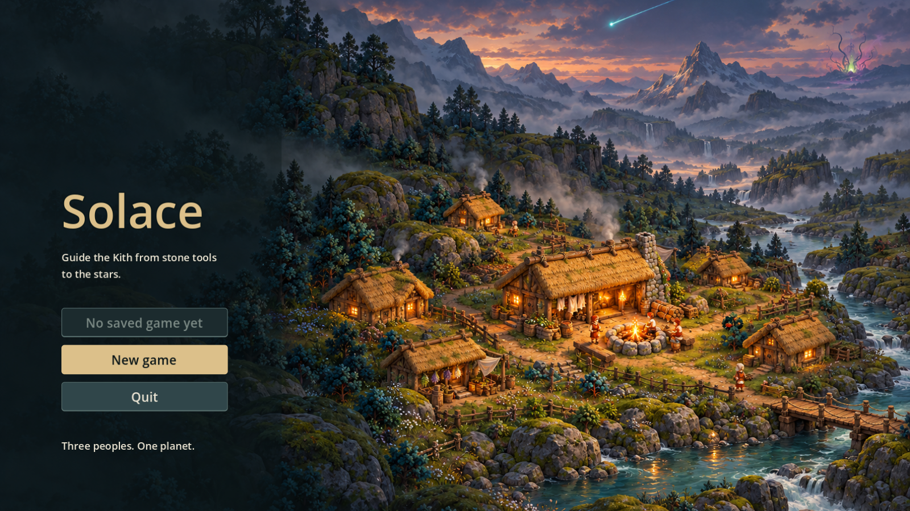

# Starfall title painting

Codex, 2026-10-06. First small delivery from the [Starfall brief](../starfall-art-brief.md).

The production asset is [title.png](../../../art/rendered/title.png), loaded automatically by the existing `TitleScreen.ART_PATH`. Its Godot-generated import accompanies it. No game code, menu wording, save behavior or map sprites changed.

The warm Kith Hearth and thatched settlement are the focus. A cyan falling star and distant magenta/green growth hint at the Lumen and Bloom. The left third remains dark for the live menu; no text is baked into the painting. The source references were the blended-regions landscape paintover and the production Kith building sheet, used only for style and architecture.

## Actual title-screen captures

These are the existing Godot title scene using the production asset, not AI interface mockups. The capture script uses a nonexistent preview-save path and does not enter gameplay or modify a real save.

Menu contrast, the Hearth, the falling star head and the Bloom hint remain visible in both views. Centered cover cropping at 16:9 trims the sky and foreground; the star trail is partly cropped, while its bright head remains visible.

## Source and limits

Built-in imagegen produced **1586×992** (approximately 16:10), despite the prompt requesting about 2560×1600. This original PNG is retained unchanged: it is not an upscaled 2560-pixel master. It is sharp at the default 1280×800 window; higher-resolution displays enlarge it. This resolution limitation is explicit for review, rather than hidden by resampling. One generation, no variant sweep.

Exact prompt and generated-source provenance: [prompt.json](prompt.json). Reproduce the captures with Godot 4.7.2 using `-s docs/art/starfall-title/capture.gd`. The documentation folder is excluded from asset imports by `.gdignore`.

Validation: Godot import succeeded; actual title captures at 1280×800 and 1600×900 loaded the new texture without application errors. The known OpenGL 2D-MSAA driver warning is exempt under the repository's checked runner. Full CI remains required before Claude merges.

## Remaining Starfall deliveries

This PR supplies only the title. Next small group: Glyph Wall (2×1), Lumen Camp (2×2), Expedition Post (1×1) and Wreck (about 2×1), with transparent backgrounds and existing anchors. Then Lumen strangers/party packs, item and glyph/gift illustrations, moment/ending vignettes and the first Bloom sign. Later Guard Post/shrine/trade stall, later goods and the unlisted magic tech tab remain deferred per the brief; beast canon remains pending.
