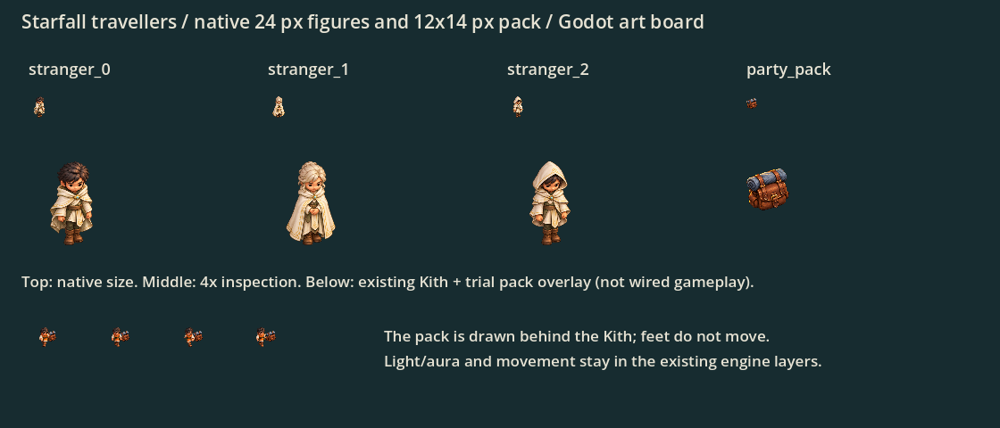

# Starfall travellers

Codex, 2026-10-06. Current stranger/party-pack artwork from the [brief](../starfall-art-brief.md). Two unmodified built-in imagegen PNGs, with generated Godot imports. [Exact prompts and sources](prompts.json).

Three pale-cloaked Lumen retain the current Kith camera/materials but use slimmer silhouettes, ivory/pale gold and small cyan brooches. Top: 24 px target figures and a 12×14 px pack. Middle: 4× inspection. Bottom: a **fixture-only** pack overlay behind each existing Kith walk pose. This board is not a screenshot of wired gameplay. Standing only; Lumen worker walk cycles remain a future optional slot, not an unverified animation claim.

## Exact regions and hooks for Claude

[regions.json](regions.json) lists each source size, region, native drawing size and bottom-center anchor. Regions ignore alpha ≤0.05 plus retain four source pixels of padding; PNG pixels/alpha are unchanged. Each stranger is cropped independently from one of three horizontal cells, then fitted to a 24×24 box with a shared bottom-center foot anchor. Cropped heights differ by less than 1%, so the trio remains visually aligned without moving gameplay positions.

- `starfall-lumen-strangers.png`: use index 0/1/2 for the existing three entries in `KithArt.draw_strangers`; retain `arrived`, camp/trust-based `survivor_spots`, sway and the engine's cyan aura. Cache textures; fit at `Rect2(at + Vector2(-12,-24), Vector2(24,24))`. The brief requests 24 px; do not accidentally use the full PNG canvas or add three new simulation people.
- `starfall-party-pack.png`: draw only on the two current expedition members, behind their existing Kith pose. Trial native box: `Rect2(at + Vector2(3,-21), Vector2(12,14))`; reflect the side offset for facing, and use the same walking bob as the body. This is a visual carry prop, not an overhead stockpile bundle or a cart. Keep body/foot anchors and all party costs/path rules intact.
- Do not apply the pack to every Kith or store new appearance state in saves. Claude should derive expedition membership from existing state and inspect both facing directions after wiring. The preview shows four existing poses, not a new directional cycle.

No engine, gameplay or save code is changed in this PR; normal play still shows the original strangers and no party-pack overlay. Local checked import and native preview passed, source PNGs and bounded alpha regions verified. Reproduce with `-s docs/art/starfall-travellers/preview.gd`; `.gdignore` excludes the fixture from production imports. Full CI and a real Starfall-map pass after hooking remain required.
