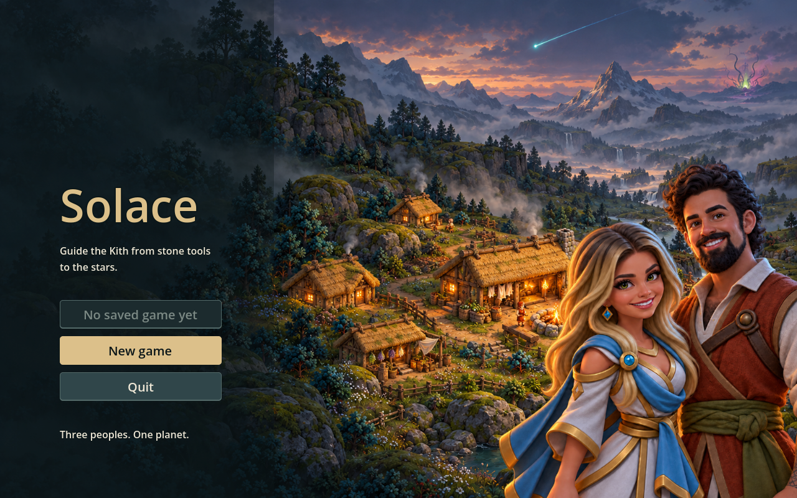
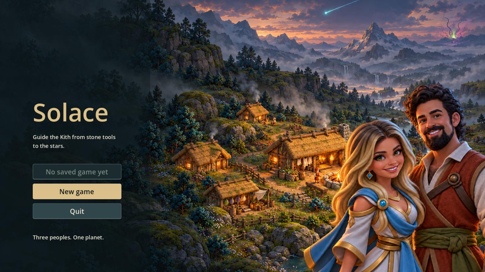

# Sela and a Kith character: title v4 (PR #75)

the project owner directed a staged workflow: draw each character separately at a lower camera angle, then pair them in the foreground with the original approved town painting behind. This composition replaces the three rejected middle-distance/giant attempts.

## Delivered
- `art/rendered/title_alt.png`: 1586×992 alternate title, no text. The Kith/Lumen pair occupies a separate near foreground plane on the right; the original dusk town and sky are behind. The left menu area remains clear.
- `art/rendered/title-pair-foreground.png`: generated transparent paired foreground, copied unchanged, with Godot import. Region **[304,0,1054,992]**. Preserve this layer for future layout changes rather than regenerating the landscape.
- `original-background.png`: byte-identical approved painting from PR #68, retained here as the reproducible composition input. The production default title is not replaced.
- [Separate Sela study](../lead-stranger/character-v2.png), [separate the project owner study](../kith-study/character-v1.png) and [Sela v1 reference](../lead-stranger/reference/lead-stranger-v1.png) remain available.

## Layers and provenance
Built-in `image_gen` used the original painting and two separate character studies for a composition study, then extracted a transparent pair. That generator may reinterpret details of the reference studies; the extracted layer is a new generated asset, not a pixel-identical paste of each individual. Its study is retained as `composition-study.png` and is not the final title background.

`compose.gd` renders the approved original background texture plus the paired foreground in Godot. It does not rewrite either source texture. [layers.json](layers.json) records the exact crop/layout: canvas 1586×992, foreground box approximately [991.25,317.44,716.72,674.56]. Both background and foreground originals were checked byte-identical to their selected tool outputs. [Prompts and source records](prompts.json).

The default title background is unchanged. This final image retains the original source resolution; the original painting is below the approximately 2560×1600 request. No artificial enlargement is used to claim extra detail. V4 reduces pair height from 78% to 68% of canvas (about 13% smaller), moves the pair farther right and deliberately crops the right shoulder/arm at the edge. Both faces remain inside the title crop. This exposes the warm Hearth fire and more town/river while preserving the star and Bloom hint. Cooler dusk fill, subdued frontal highlights and warm left/cool right rim light tie the pair to the scene. V3 and its prior source/layout/menu previews are preserved under `archive/v3/`; [v4 review image](title-v4.png) and [relighting prompt](v4-prompt.json) record this revision.

## Claude hookup
Claude already added alternate selection in main through PR #74: with both `title.png` and `title_alt.png` present, the title chooses randomly between them; with just one, it shows that one. The original painting is supplied separately in PR #68, so merge that too for both choices. This PR preserves the caller/menu/save behavior and does not edit production code. If later drawing the two layers independently, use the measured region and layout manifest, and scale/crop both together to preserve this composition.

This title artwork does not add the Kith character as a gameplay person or change visitor counts. The 24 px Sela map slot remains its separate review/hook requirement; do not reuse a title portrait as a map sprite.

## Validation
Godot-generated imports for both production PNGs passed. The reproducible two-layer render passed. Actual existing title-menu captures (preview-only injected alternate texture, no run save changes) were inspected at 1280×800 and 1600×900: menu labels/buttons clear; both faces, falling star head and distant Bloom visible. At 16:9 the top of the star trail is cropped, matching the existing cover behavior. Full CI status is tracked on PR #75; production selection follows Claude’s existing #74 hook; current captures inject v4 to inspect it deterministically.
