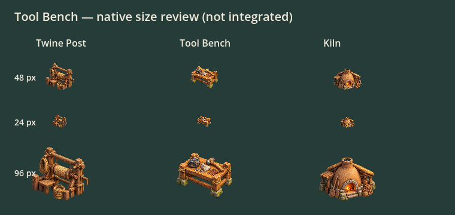

# Tool Bench art handoff

Transparent rendered miniature for Claude's first open sprite request. **Art supplied; not loaded by the game yet.** The existing Twine Post alias remains in production. Growth art remains pending Jon's approval of page 17.



The low timber bench carries a charcoal flint core, wooden-handled stone hammer, pale half-shaped axe head and leather pad. Chunky lashings and mossy stone feet match the Twine Post/Kiln; the open silhouette distinguishes it from roofed workshops. Light comes from upper left. At 48 px it reads as a tool workbench; at 24 px the tools merge into contrasting marks, so the UI label remains important.

## Files and provenance

- `tool-bench.png`: original built-in image-generation output, unchanged RGBA, 1254×1254; genuine transparent corner verified in Godot.
- `prompts.json`: exact prompt, existing workshop reference and original source path.
- `native-preview.png`: actual Godot drawing at 48, 24 and 96 px using the production aspect-preserving `Rendered.fit` helper. Same fit and lighting reference for all three subjects; not a paintover or in-game screenshot.
- `preview.gd`: reproducible review script. `.gdignore` keeps these review files outside game imports.

## Claude integration

Keep `tool_bench` callers and the 1×1 gameplay footprint. The current rendered miniature is the intended appearance; do not reintroduce flat SVG styling as its primary display.

1. Copy the PNG into an agreed production rendered slot (suggest `art/rendered/tool-bench.png`), preserving alpha. Run Godot import and commit generated metadata.
2. Register one atlas region with alpha bounds `Rect2(0, 19, 1242, 1193)` in `Rendered.REGIONS`, and map `SINGLE_BUILDINGS["tool_bench"]` to its sole region. Ensure `Rendered.named("tool_bench")` resolves it for build/research icons as well as map drawing.
3. Remove `Art.SPRITE_OF["tool_bench"] = "twine_post"` only once the new rendered lookup resolves. If the legacy fallback requires `art/sprites/tool_bench.svg`, add that compatibility asset/import in the integration change; no new production sprite slot is added by this art-only PR.
4. Check actual map and build/research card appearance at 48/24 px, unchanged placement footprint, import cleanliness and required CI.

Reproduce from repository root:

```sh
tests/tools/run_checked.sh /Applications/Godot.app/Contents/MacOS/Godot --path . --script docs/art/tool-bench/preview.gd
```

The preview asserts a nonempty image, actual transparent background and usable alpha bounds. Local error-free native capture, focused script lint/format and diff checks passed. Full integration validation belongs to the loading change.
