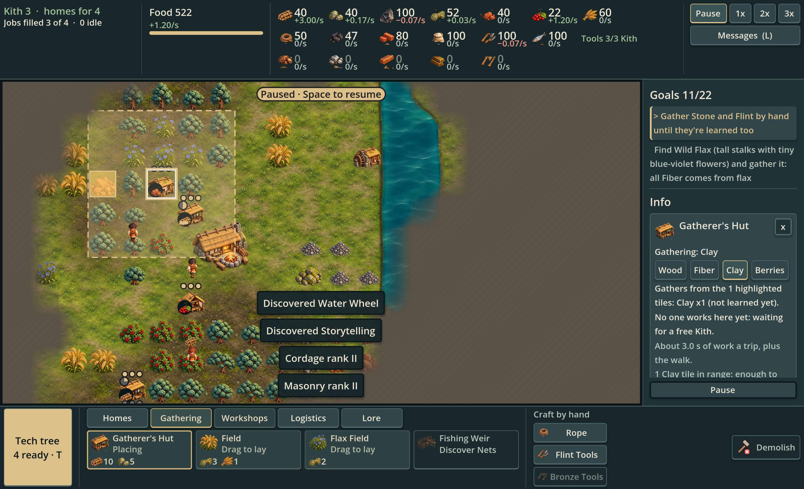
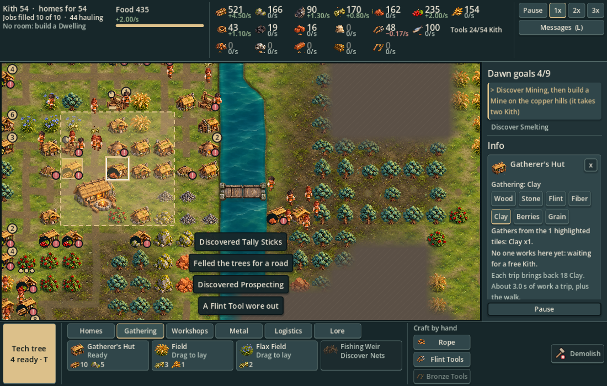
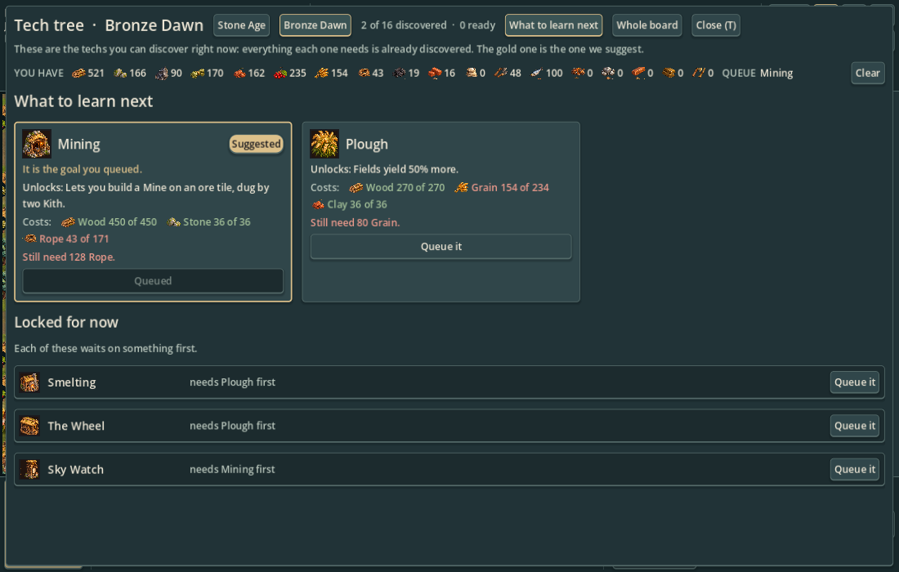
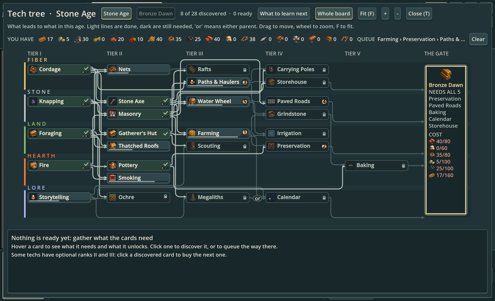

# Interface for the rendered miniature world

Current visual specification, 2026-10-04, PR #33. Jon accepted the grounded, atmospheric map direction and requested that the UI/UX follow it. Codex implemented this first interface pass in the actual game.

The interface should feel like a quiet field journal beside a living miniature landscape. Use plain surfaces and readable labels: texture belongs in the world and subject icons, not behind dense resource numbers.

| Role | Color | Use |
|---|---|---|
| Bar | `#17272a` | HUD rails, quiet inset surfaces |
| Panel | `#213337` | Research and selection panels |
| Card | `#30464a` | Interactive cards and buttons |
| Selected | `#3a5354` | Pressed controls |
| Text | `#eee7d6` | Primary labels |
| Secondary text | `#bac7bd` | Explanations and inactive context |
| Brass | `#dcc08a` | Tech action, current goal, suggested research, selection rims |
| Moss | `#a4c199` | Positive rates and completed states |
| Ember text | `#ec9a8c` | Shortfalls and urgent text |
| Danger surface | `#c96062` | Active demolish mode |

Primary and secondary text must achieve at least 4.5:1 contrast on shared surfaces, including selected controls. Brass-filled actions use dark labels. Keep existing font sizes (14 px minimum), wrapping and adaptive layouts. Fine borders, small corners and soft shadows provide grouping without heavy black boxes.

The current goal receives a brass edge and separate surface. The next goal stays subdued. Recommended research uses the same emphasis; available, queued and locked cards retain their existing words and interactions. Demolish stays quiet until activated, then receives a danger surface. Existing item icons tie HUD resources and costs to map subjects.

## Actual Godot previews

These are viewport captures from the main scene and its existing layout harness, not concept paintings. The developed settlement is staged with the existing pacing bot.

## Scope and remaining design work

This pass changes shared theming and visual hierarchy across the HUD, research, cards and selection panels. Layout and input remain the established gameplay interface. Resource-density reduction, richer contextual guidance and broader information architecture need separate gameplay UX design; this pass does not claim to resolve them. Do not add ornamental wood or parchment textures that reduce small-text contrast. No global map-scale change was made.
