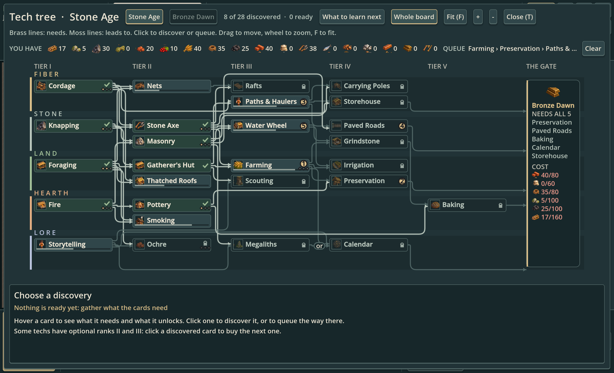
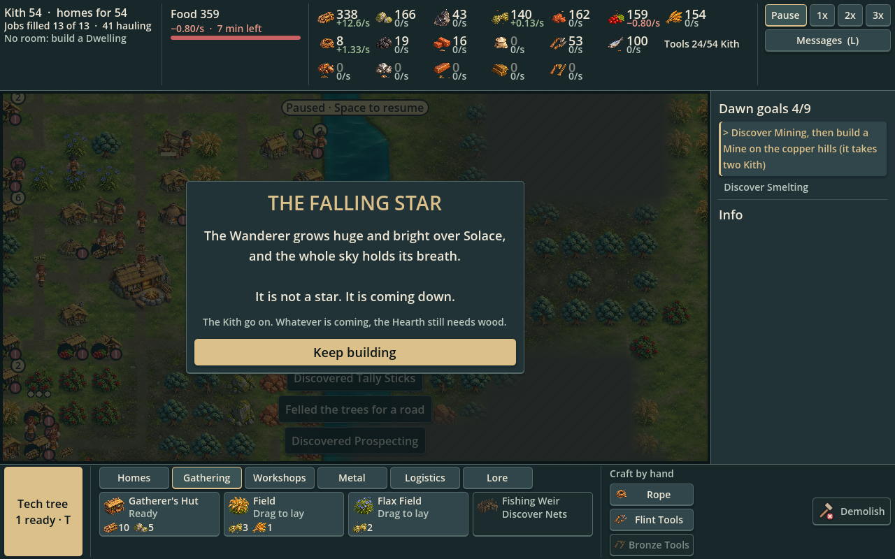
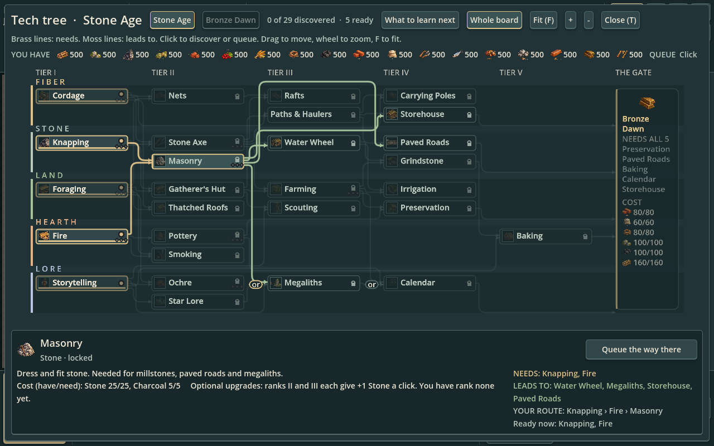
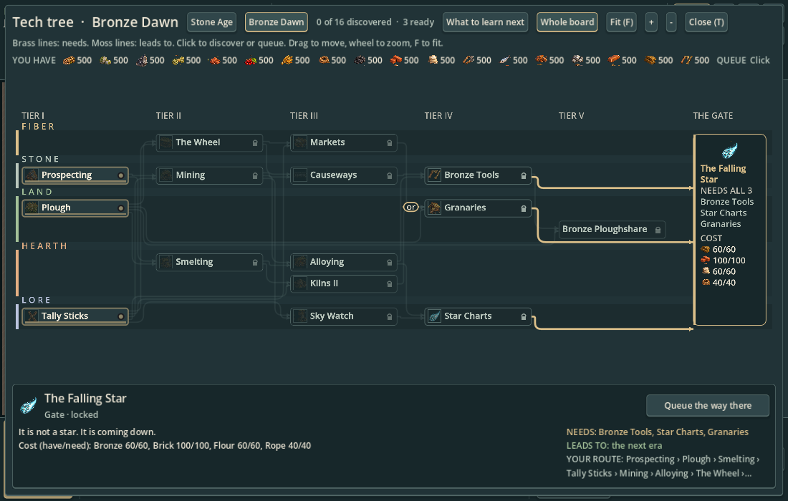

# Interface for the rendered miniature world

Current visual specification, 2026-10-04, PR #33. Jon accepted the grounded, atmospheric map direction and requested that the UI/UX follow it. Codex implemented this first interface pass in the actual game.

The interface should feel like a quiet field journal beside a living miniature landscape. Use plain surfaces and readable labels: texture belongs in the world and subject icons, not behind dense resource numbers.

| Role | Color | Use |
|---|---|---|
| Bar | `#17272a` | HUD rails, quiet inset surfaces |
| Panel | `#213337` | Research and selection panels |
| Card | `#30464a` | Interactive cards and buttons |
| Selected | `#3a5354` | Pressed controls |
| Text | `#eee7d6` | Primary labels |
| Secondary text | `#bac7bd` | Explanations and inactive context |
| Brass | `#dcc08a` | Tech action, current goal, suggested research, selection rims |
| Moss | `#a4c199` | Positive rates and completed states |
| Ember text | `#ec9a8c` | Shortfalls and urgent text |
| Danger surface | `#c96062` | Active demolish mode |

Primary and secondary text must achieve at least 4.5:1 contrast on shared surfaces, including selected controls. Brass-filled actions use dark labels. Keep existing font sizes (14 px minimum), wrapping and adaptive layouts. Fine borders, small corners and soft shadows provide grouping without heavy black boxes.

The current goal receives a brass edge and separate surface. The next goal stays subdued. Recommended research uses the same emphasis; available, queued and locked cards retain their existing words and interactions. Demolish stays quiet until activated, then receives a danger surface. Existing item icons tie HUD resources and costs to map subjects.

## Actual Godot previews

These are viewport captures from the main scene and its existing layout harness, not concept paintings. The developed settlement is staged with the existing pacing bot.

## Scope and remaining design work

This pass changes shared theming and visual hierarchy across the HUD, research, cards and selection panels. Layout and input remain the established gameplay interface. Resource-density reduction, richer contextual guidance and broader information architecture need separate gameplay UX design; this pass does not claim to resolve them. Do not add ornamental wood or parchment textures that reduce small-text contrast. No global map-scale change was made.

## Whole-interface audit (2026-10-05)

Research now uses miniature atlas illustrations for every tech, including the former drawn symbols, people, storage, quarry and falling star. Illustrations preserve aspect ratio in charcoal inset frames. These UI illustrations do not replace corresponding map sprites. Original generated RGBA atlases and exact built-in-tool prompts are preserved in [research asset provenance](../../../art/rendered/research-prompts.json).

Lane captions use muted ochre, stone, moss and pale lavender instead of the baseline saturated colors. Both research views share brass discover/buy actions, quiet queue actions, moss completion and ember shortfalls. Hovering a dependency branch retains more context in unrelated cards. The gate uses a single brass rail instead of a double heavy frame.

Shared themed scrollbars now serve research, the message log and other scroll containers. The milestone card uses the same charcoal scrim and brass action; notifications use a fine rim and ember emphasis for persistent alerts. HUD chips, resource flow detail, building/trade controls, goals, research recommendations, both era boards, messages, tooltips and the milestone card were included in the audit. Existing layouts, controls, shortcuts, research rules and save behavior remain unchanged. Dense stock strips and long fitted-board titles remain limits of the established layout; the normal tech detail panel retains full names.

## Research readability and persistent focus (2026-10-05)

A clicked discovery now retains a distinct selected surface, brass selection rim/left rail and its immediate dependency context after the pointer leaves. Hovering another discovery previews that branch; leaving it restores the clicked branch. Incoming dependencies use brass and outgoing unlocks moss, matching the Needs/Leads to inspector labels. Other connections recede while card names remain opaque and at least 14 px. Either-or junctions retain their existing labels and rules; highlighting does not choose a new prerequisite route. Switching eras clears presentation focus.

Names take priority over pictures on compact board cards: hide a picture if it would force the name to truncate. The tall gate's destination wraps onto multiple lines. Every hovered visible card has a full-name tooltip. Extreme zoom can still trim a compact label; the inspector always separates its full name from state, lane and optional-branch context.

The fixed-height inspector now places an illustration, full title/state and existing action in a header, with explanation/costs on the left and Needs/Leads to/route on the right. Long detail text has full-text tooltips. The last hover inspection remains available while moving to the action when no clicked selection exists; a clicked selection returns when hover ends. Existing card clicks still discover, queue or buy an upgrade. No research rules, prices, queue ordering or save state changed.

These actual Godot main-scene captures stage stock levels and selected cards for review; they are interface previews, not economy/balance playtest results.

